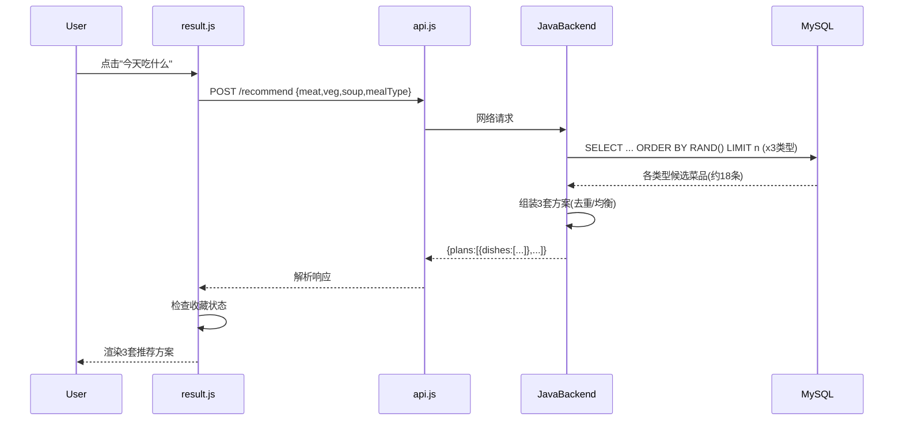

## 产品概述

"吃什么"小程序首页点击"今天吃什么"后，平均需要等待15秒才能生成菜谱推荐，用户体验极差。需要将生成时间优化到3秒以内。

## 问题诊断

1. **重复请求**：`result.js` 的 `generatePlans()` 使用 `Promise.all` 并行调用 `recommendPlans()` 和 `getAllDishes()`，而 `recommendPlans()` 内部又调用了一次 `getAllDishes()`，导致 `/api/dishes/lite` 被并发请求两次
2. **全量数据传输**：后端 `selectAllDishesLite()` 无分页限制，数据库有2万+条菜品，每次全量传输约2-4MB数据
3. **前端数据处理开销**：`getAllDishes()` 对2万条数据逐条做类型映射、tags解析，CPU开销大
4. **无缓存机制**：每次进入 result 页面都重新全量拉取菜品数据
5. **无预加载**：`app.js` 登录后没有预加载菜品数据

## 核心需求

- 将"今天吃什么"菜谱生成时间从15s优化到3s以内
- 保留现有推荐算法逻辑（荤素汤随机搭配、去重、餐次偏好）
- 保持向后兼容，网络异常时可降级到本地推荐

## 技术方案

### 核心策略

**后端直出推荐 + 前端全局缓存 + 消除重复请求**

#### 1. 后端新增 `/recommend` 直出接口（性能提升最大）

后端直接执行 `SELECT ... ORDER BY RAND() LIMIT n` 按类型随机取菜，在 Java 中组装3套推荐方案返回。前端只需一次请求，数据量从2万条降至约15条。

**为什么有效：**

- 减少数据传输：2万条 → 15条，数据量减少99.9%
- 减少前端处理：无需类型映射和 tags 解析
- 减少网络往返：从2次全量请求 → 1次轻量请求

**MySQL 性能：** `ORDER BY RAND() LIMIT 6` 在2万条数据上执行耗时 < 50ms，远快于全表扫描+网络传输。

#### 2. 消除前端重复调用

`result.js` 的 `generatePlans()` 不再并行调用 `recommendPlans()` 和 `getAllDishes()`，改为单一推荐调用。`recommend.js` 的 `recommendPlans()` 支持接收外部 `allDishes` 参数。

#### 3. 前端全局菜品缓存

`app.js` 登录成功后预加载菜品数据到 `App.globalData.allDishes` 并持久化到本地存储。后续页面直接从缓存读取，避免重复请求。

#### 4. 降级策略

如果后端 `/recommend` 接口不可用或超时，自动回退到前端本地推荐算法（使用全局缓存的菜品数据）。

### 架构设计



### 目录结构

```
backend/src/main/java/com/eatwhat/
├── controller/
│   └── RecommendController.java        # [NEW] 推荐直出接口
├── dto/
│   └── PlanDTO.java                    # [NEW] 推荐方案DTO
├── service/
│   └── DishService.java                # [MODIFY] 新增 generateRecommendPlans
└── mapper/
    └── DishMapper.java                 # [MODIFY] 新增 selectDishesRandomByType

前端：
├── app.js                              # [MODIFY] 登录后预加载菜品
├── utils/
│   ├── api.js                          # [MODIFY] getRecommendations 适配新接口
│   └── recommend.js                    # [MODIFY] 支持外部 allDishes 参数
└── pages/
    └── result/
        └── result.js                   # [MODIFY] 重写 generatePlans 调用后端推荐
```

### 关键代码结构

**后端 PlanDTO：**

```java
public class PlanDTO {
    private List<Dish> dishes;
}
```

**后端 RecommendController：**

```java
@RestController
@RequestMapping("/recommend")
public class RecommendController {
    @PostMapping
    public ResponseEntity<?> recommend(
        @RequestBody RecommendRequest req,
        HttpServletRequest request
    ) { ... }
}
```

**前端 result.js 调用逻辑：**

```js
async generatePlans() {
  try {
    // 优先调用后端直出推荐
    const result = await api.getRecommendations(this.data.params)
    this.setData({ plans: result.plans, loading: false })
    this.checkFavoriteStatus()
  } catch (e) {
    // 降级：使用本地缓存菜品 + 本地算法
    const allDishes = getApp().globalData.allDishes || await getAllDishes()
    const plans = await recommendPlans(this.data.params, allDishes)
    this.setData({ plans, loading: false })
  }
}
```

### 性能预估

| 优化项 | 优化前 | 优化后 |
| --- | --- | --- |
| 网络请求次数 | 2次全量 | 1次轻量 |
| 单次数据传输 | 2-4MB | ~3KB |
| 前端数据处理 | 2万条循环 | 15条直接渲染 |
| 后端查询 | 全表扫描 | 随机取前N条 |
| 总耗时 | ~15s | ~1-3s |