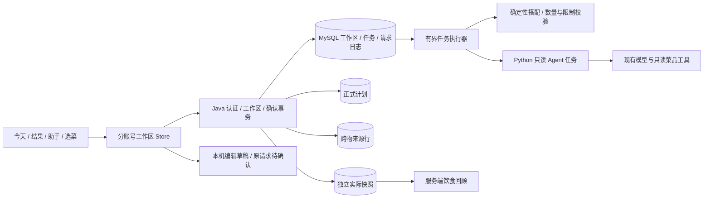

# Eat-What V4 深绿版：前后端详细设计

> 更新：2026-10-03，业务日期使用 Asia/Shanghai。基准 HEAD `47b854ed4b8d3c1683baa248cf9a3701515511b2`，分支 `codex/full-ui-meal-workflow`，包含开工前未提交改动。
>
> 本文对应用户批准的 V4 主闭环与全量界面实施计划。源码已实施；V4 默认关闭，尚未发布。自动化、独立 MySQL 与本地 HTTP 验证和原生编译分别登记，不能代替 25 页运行交互及 iOS/Android 真机验收。外部两份文档是设计参考，最终采纳范围以本实施计划及本文为准。
>
> 快速了解改造原因、用户效果及接手方式见 [开发者改造说明](./eat-what-developer-change-guide.md)。验收执行记录见 [实施记录](./full-ui-implementation-progress.md)。

## 1. 目标、边界与权威数据

闭环为 **当前餐决定菜单 → 确认到日历 → 采购预览与购物 → 明确确认实际用餐 → 周/月回顾**。

- 个人账号，全部 25 个注册页面、内部表单、选择面板、确认弹层和适用状态。原路由、原业务接口、管理权限保留。
- 四 Tab：今天、菜谱、计划、我的。购物属于计划；回顾从我的和计划进入。聊天是进一步表达需求的界面。
- Java/MySQL 是当前餐工作区与业务写入的权威来源。今天、结果和助手读取同一工作区，不能自行从 Java/Python 两套方案挑选“最新”。
- 未确认草稿、正式计划、采购、实际记录相互独立。“就吃这个”只保存明确显示的日期/餐次计划；采购勾选不算吃过；改计划不修改实际快照。
- 基础反馈用于采集和验证，不自动学习或写入推断偏好。本餐人数、客人忌口不修改常用人数或长期设置。
- 本版不建立家庭协作、库存数量账本、营养核算、跨餐食材优化、独立 Web 管理后台。缺少可靠用时不显示整餐估值，不展示无依据热量。

## 2. 架构与模块



| 模块 | 源文件与职责 |
|---|---|
| 原生前端 | `app.json`、`pages/`、`templates/meal-workspace.wxml`；原生 JavaScript/WXML/WXSS、glass-easel |
| 工作区 Store | `utils/meal-workspace.js`：三层状态、CAS、原 key 重试、账号隔离 |
| 共享页面行为 | `utils/meal-workspace-page.js`：今天/结果/助手、500ms 合并保存、轮询、确认和来源跳转 |
| 兼容导入 | `utils/legacy-meal-import.js`：已有助手多餐结果逐餐导入，保留目标和人数，再独立确认 |
| 主题与资产 | `design/tokens.json`、`design/*.tpl`、`design/wxss/`、`scripts/build_ui_assets.py`、`components/` |
| 工作区服务 | `MealWorkspaceService`、`MealWorkspaceController`、`MealWorkspaceMapper`；用户归属、版本、确认与回执 |
| 规则与任务 | `MealWorkspaceRules`、`MealWorkspacePlanner`、`MealWorkspaceTaskRunner`；搭配、保留/撤销、持久化队列 |
| Agent 网关 | `MealWorkspaceAgentGateway`、`recommend-service/workspace_agent.py`；内部凭证、只读 provenance、超时与保守澄清 |
| 计划/实际/回顾 | `RecipeRecordService`、`MealPlanService`、`MealConsumptionService`、`DietReviewCalculator` |
| 购物 | `ShoppingPreviewService`、`ShoppingListService`、`ShoppingMutationService`；可信用量、原始来源、手动项与幂等 |
| 偏好与反馈 | `UserPreferenceService`、`MealBehaviorService`；明确常用人数、允许名单事件、服务端业务事件 |
| 迁移/验证 | `V3__meal_workflow.sql`、`V4__meal_workspace.sql`、迁移 manifest、`scripts/verify.ps1`、MySQL/原生编译独立脚本 |

保持 Spring Boot 2.7.14 / MyBatis / Java 8、MySQL 8、现有 Python FastAPI/推荐服务。Python 旧会话仍供兼容使用；V4 内部任务不把方案状态交给 SQLite 管理。模型和生产 Python 依赖沿用原项目，实际生产版本需发布前确认。

## 3. 当前餐状态与默认搭配

| 状态 | 主操作 | 辅助动作 / 数据含义 |
|---|---|---|
| empty / expired | 帮我安排 | 修改日期餐次、人数、本餐条件；自己选菜 |
| generating | 等待 / 停止 | 原方案保留；重复点击禁用；迟到结果须匹配任务与工作区版本 |
| draft | 就吃这个 | 换一道/一套、保留/解除、撤销、继续表达要求 |
| needs_regeneration | 帮我安排 | 条件已改；旧菜单可查看，重新安排和校验后才能确认 |
| needs_input | 补充限制后重试 | 不能可靠理解时保留旧方案，不宣称限制已满足 |
| planned | 查看做法 | 采购预览、查看安排/记录实际；不会自动创建清单或实际 |
| plan_changed（前端） | 查看最新安排 | 日历已另行修改，关联正式计划用于做法与采购，不把旧草稿冒充现计划 |
| actual=eaten（关联状态） | 查看用餐记录 | 修改/撤销实际、饮食回顾；仍可明确另存调整方案 |
| offline / pending / conflict（同步状态） | 原请求重试 / 查看最新 | 保留本机输入；冲突需重新应用和确认，不自动覆盖 |

日期首次按北京时间；10 点前早餐，10–16 点午餐，16 点后晚餐。打开后的工作区不由时钟改写。自由文本指向其他目标时返回建议，用户明确点击切换后才在目标餐次生成。

人数为整数 1–50；无明确常用人数时默认 2。设置页保存 `defaultPeople`，本餐调整只影响当前工作区。

午晚餐自动菜数 `N = min(10, ceil(people / 2) + 1)`，荤菜 `floor(N / 2)`，其余素菜；默认无汤、主食、甜品。两人一荤一素、四人一荤两素、六人两荤两素。

早餐只使用 `BREAKFAST_ELIGIBLE`：1–2 人一主食一配餐，3–4 人一主食两配餐，5 人及以上两主食两配餐。非主食候选作为配餐；保留项必须满足场景和忌口。首批 6 条基础菜、两人基础份量和数据检查见 [候选清单](./breakfast-candidates.md)，产品审阅/实做仍待完成。

手动修改菜数或明确选菜进入 manual 模式，人数变化只影响份量。恢复自动搭配后重新计算数量。无法满足数量、保留项或限制时不改写旧方案。

整餐时间为可靠 `cookMinutes` 的依次制作合计；默认无整餐硬上限。它与旧的单菜 `maxCookMinutes` 是不同字段。缺少用时不能通过整餐硬限制，也不输出伪估值。已有食材只提高推荐优先级及支持采购核对，不扣库存。

## 4. 全量页面与内部功能清单

表中“原生编译”指统一编译检查，未运行逐页点击。全部行均须执行第 11 节适用状态验收；未登录仅要求受保护功能提供入口和解释，日志/关于等无远端页面不强加无意义的离线或版本冲突。

| 路由 | 入口 | 正常状态 / 内部小功能 | 异常与交互状态 | 返回行为 | 接口 | 验收结果 |
|---|---|---|---|---|---|---|
| `pages/index/index` | 今天 / Tab | 当前日期/餐次/人数、自由需求、本餐设置、自动/手动菜数、生成/换菜/保留/撤销、直接确认、做法/采购/实际入口 | 恢复中、无方案、生成中、needs_input、条件待重生成、未同步/离线、未知请求、409、账号变化清空视图 | Tab 保留本账号条件；二级页返回刷新 | V4 workspace GET/create/context/commands/confirm；原概览接口保留 | 源码/结构检查；原生编译统一检查；运行交互与真机待验收 |
| `pages/logs/logs` | 保留的旧日志链接 | 启动时间列表、清空本机日志确认 | 空记录；取消清空保持原数据 | 返回原入口 | 本机 logs 存储 | 源码/结构检查；原生编译统一检查；运行交互与真机待验收 |
| `pages/result/result` | 今天 → 推荐结果 | V4 与今天共用当前餐；选菜导入、换一道/一套、保留/撤销、确认与后续做法；关闭开关保留旧结果 | 生成中、空结果、超时保留旧方案、保存错误保留方案、重复提交保护 | 返回今天；保存后可进入计划详情 | V4 workspace 接口；旧推荐/收藏/meal-plans 保留兼容 | 源码/结构检查；原生编译统一检查；运行交互与真机待验收 |
| `pages/dish-detail/dish-detail` | 结果 / 菜谱 / 收藏 / 餐次 → 菜品 | 食材与步骤、图片预览、收藏、自定义编辑、按本餐人数读取可信采购用量 | 加载、失败重试、缺图占位、收藏提交中、账号变化重新读取 | 返回来源页 | 原菜品详情/收藏；POST /shopping-list/preview | 源码/结构检查；原生编译统一检查；运行交互与真机待验收 |
| `pages/customize/customize` | 菜谱 / Tab；计划 → 选菜 | 分类分页、搜索、筛选、已选面板、自定义菜表单；工作区入口显式导入当前餐手动草稿 | 加载、无菜、无搜索结果、读取失败重试、表单失败保留输入 | Tab；从计划进入保存后回到餐次详情 | 原菜品/自定义菜；workspace select；旧 meal-plans 编辑保留 | 源码/结构检查；原生编译统一检查；运行交互与真机待验收 |
| `pages/calendar/calendar` | 计划 / Tab；旧日历链接 | 周/月与星期标题、选日期、上一/下一周期、回今天、三餐状态、周期采购、购物与回顾 | 未登录、读取中、带标识缓存、重试、无安排餐卡 | Tab；旧选择日期协议按用户存储返回调用者 | GET /recipe-records/overview | 源码/结构检查；原生编译统一检查；运行交互与真机待验收 |
| `pages/calendar-detail/calendar-detail` | 计划 / 今天 / 回顾 → 某日 | 编辑名称与人数、选菜、复制同餐到别日、删除计划、采购、按计划吃了、实际换菜、取消、撤销 | 加载、失败重试、提交中、输入错误、409、未来禁止标记已吃 | 返回来源；成功刷新计划与回顾标记 | 概览；PUT/DELETE /meal-plans；PUT /meal-consumptions | 源码/结构检查；原生编译统一检查；运行交互与真机待验收 |
| `pages/profile/profile` | 我的 / Tab | 登录弹窗、头像/昵称入口、回顾、收藏、自定义菜、偏好、购物、同步、管理入口 | 游客说明、登录失败反馈、购物缓存标识、回顾不可用占位、缺图 | Tab；登录关闭保持原页面 | 原登录/用户接口；/diet-reviews；/shopping-list | 源码/结构检查；原生编译统一检查；运行交互与真机待验收 |
| `pages/about/about` | 我的 → 关于 | 五步用餐指南、偏好记忆说明、离线与统计口径、版本 | 版本读取不到显示开发版本；无远端依赖 | 返回我的 | 微信版本信息 API | 源码/结构检查；原生编译统一检查；运行交互与真机待验收 |
| `pages/statistics/statistics` | 我的 / 计划 → 饮食回顾 | 周/月、历史周期、实际餐次/天数/已识别种类、常吃菜、分类覆盖率、到期执行、记录跳转 | 加载、无实际记录、读取错误重试；无实际也展示到期未确认 | 返回来源；记录进入对应日期 | GET /diet-reviews | 源码/结构检查；原生编译统一检查；运行交互与真机待验收 |
| `pages/sync/sync` | 我的 → 数据同步；旧同步链接 | 本账号各餐未同步工作区/未知请求入口、历史安排逐条确认、购物草稿、清理本机已同步副本 | 未登录、无草稿、同步中、首个错误停止并保留剩余 | 返回我的；取消当前草稿继续保留 | workspace 请求查询/原请求重试入口；概览/meal-plans；购物草稿 | 源码/结构检查；原生编译统一检查；运行交互与真机待验收 |
| `pages/favorite-dishes/favorite-dishes` | 我的 → 收藏菜品 | 搜索、详情、取消收藏确认、浏览菜谱 | 加载、空收藏、无搜索结果、失败重试、删除中、账号变化清空 | 返回我的；浏览按钮切到菜谱 Tab | 原收藏接口 | 源码/结构检查；原生编译统一检查；运行交互与真机待验收 |
| `pages/settings/settings` | 我的 → 偏好设置 | 常用人数 1–50、菜系、偏好/排除标签、长期忌口、重复窗口、单菜用时、保存/重置确认 | 加载、本机草稿未同步标识、提交中、失败保持 dirty、账号变化重置 | 返回我的；草稿仅缓存本账号 | 原偏好/推荐元数据接口 | 源码/结构检查；原生编译统一检查；运行交互与真机待验收 |
| `pages/recommend-filter/recommend-filter` | 今天 / 菜谱 → 更多筛选 | 菜系、包含/排除标签、食材、时长、清空、应用 | 元数据加载、缓存离线说明、空选项、账号变化隔离 | 应用通过本账号临时条件返回调用者；关闭不覆盖原条件 | 原推荐元数据接口；本机临时条件 | 源码/结构检查；原生编译统一检查；运行交互与真机待验收 |
| `pages/profile-edit/profile-edit` | 我的 → 个人资料 | 微信选头像、昵称输入、明确保存/取消、注册天数 | 未登录、提交中、失败保留输入、头像格式/大小错误、头像版本冲突、账号变更重置 | 取消恢复原资料并返回；保存后仍可检查 | POST /users/avatar；PUT /users/info | 源码/结构检查；原生编译统一检查；运行交互与真机待验收 |
| `pages/custom-dishes/custom-dishes` | 我的 → 自定义菜；详情 → 编辑 | 列表、详情、独立编辑态、类别/食材/步骤/时长、删除确认、添加入口 | 加载、无菜、云端读取失败展示上次数据、保存失败保留表单、账号变化重置 | 取消编辑回列表；添加切到菜谱表单 | 原自定义菜 CRUD 接口 | 源码/结构检查；原生编译统一检查；运行交互与真机待验收 |
| `pages/admin/admin` | 管理员“我的”版本连点；旧管理链接 | 原管理员身份检查、兼容转工作台 | 检查中、未登录/无权限、检查失败 | 检查成功 redirect 工作台；失败可返回我的 | 原管理员身份检查接口 | 源码/结构检查；原生编译统一检查；运行交互与真机待验收 |
| `pages/admin-dashboard/admin-dashboard` | 管理入口 → 工作台 | 用户/菜品概览、刷新、用户/菜品/审计入口 | 初次加载、刷新、错误重试、权限失败；保留原规则 | 返回我的或上级管理入口 | GET /admin/overview | 源码/结构检查；原生编译统一检查；运行交互与真机待验收 |
| `pages/admin-users/admin-users` | 工作台 → 用户 | 搜索、状态筛选、分页、用户详情 | 加载、空列表/无结果、失败重试、无权限 | 返回工作台；详情返回保留列表任务 | GET /admin/users | 源码/结构检查；原生编译统一检查；运行交互与真机待验收 |
| `pages/admin-user-detail/admin-user-detail` | 用户列表 → 用户详情 | 资料、状态变更确认、该用户菜品分页、添加/编辑/删除内部表单 | 加载、无菜、提交中、输入错误、失败保留表单、无权限 | 关闭表单保留云端原菜；返回用户列表 | GET/PATCH /admin/users/{id}；原用户菜品管理接口 | 源码/结构检查；原生编译统一检查；运行交互与真机待验收 |
| `pages/admin-dishes/admin-dishes` | 工作台 → 菜品管理 | 搜索筛选分页、详情、编辑、发布/下架确认 | 加载、无结果、表单错误、提交中、失败保留输入、无权限 | 关闭编辑回列表；返回工作台 | 原 /admin/dishes 查询/编辑/状态接口 | 源码/结构检查；原生编译统一检查；运行交互与真机待验收 |
| `pages/admin-audit/admin-audit` | 工作台 → 审计 | 操作者/动作筛选、分页、记录详情 | 加载、无记录/无结果、失败重试、无权限 | 返回工作台 | GET /admin/audit-logs | 源码/结构检查；原生编译统一检查；运行交互与真机待验收 |
| `pages/chat/chat` | 今天 / 计划 → 助手；旧助手链接 | V4 自由需求共用当前餐、设置/停止/澄清/显式切换目标、旧多餐草稿逐餐导入；旧会话在开关关闭时保留 | 初始化/阶段加载、无会话欢迎、服务降级说明、失败重试、方案版本冲突、账号变更清空 | 返回今天或计划；方案只是草稿，确认后才写业务数据 | V4 workspace 接口；旧助手 session 只读导入与原接口兼容 | 源码/结构检查；原生编译统一检查；运行交互与真机待验收 |
| `pages/shopping-preview/shopping-preview` | 推荐 / 菜谱 / 餐次 / 助手 → 采购预览 | 按餐次日期保留来源、人数换算、数量编辑、已有食材移除、采购汇总、确认 | 加载、菜品失效、无项目、数量错误、提交中、超时草稿、409保留预览 | 取消返回来源；成功进入清单 | POST /shopping-list/preview；POST /shopping-list/items:batch-add | 源码/结构检查；原生编译统一检查；运行交互与真机待验收 |
| `pages/shopping-list/shopping-list` | 计划 / 我的 / 预览 → 购物清单 | 食材汇总/餐次分组、全部/待购/已购、手动名称数量备注、数量编辑、批量勾选、删除/清空、草稿查看/重试/冲突重确认/丢弃 | 加载、空/筛选空、缓存离线、提交中、校验错误、409、未登录、请求未知结果 | 返回来源；草稿仅用户明确确认后重放 | GET /shopping-list；manual-items；batch-check；confirmed patch/delete；:clear | 源码/结构检查；原生编译统一检查；运行交互与真机待验收 |

### 4.1 页面内小功能验收归属

| 页面 / 功能 | 进入与提交 | 取消 / 失败 / 重复操作 | 验收证据要求 |
|---|---|---|---|
| 当前餐日期/餐次 picker | 读目标 workspace，保留旧餐草稿 | 未同步不伪报成功；旧任务回调不可覆盖新餐 | 三餐切换、返回、退出重进、两个设备 |
| 本餐设置 sheet | 人数、整餐时间、已有食材、手动菜数、恢复自动 | 关闭不应用暂存；校验错误保留；键盘避让 | 1/2/4/6/50 人、非法数字、小屏/键盘 |
| 更多筛选 | 临时菜系/标签/食材/单菜时间 | 关闭不覆盖；应用会使方案需重新校验 | 排除条件与长期偏好合并 |
| 自由需求 textarea | 500ms 合并保存，操作前等待保存 | 失败保留内容；不在回执/事件/日志保存原文 | 离线、未知结果、账号切换 |
| 换一道 / 保留 / 撤销 | 目标 ID、方案版本、工作区版本 | 锁定项不可换；撤销仍递增版本；失败保留旧菜单 | 自动化 + 原生实际点击 |
| 替换已有安排 confirm | 展示旧、新菜单；绑定所见两个版本 | 取消不写；期间版本变化 409；切账号停止旧操作 | 两设备及弹窗期间切账号 |
| 旧助手多餐导入 | 重新读 session 版本，明确切换目标，select | 旧版本变化先重新查看；仍需逐餐确认 | 多日期、人数保留、不跨餐自动写入 |
| 菜谱已选面板 / 自定义添加 | 浏览选择与独立菜品表单；来源回传 | 关闭保留原云端内容，提交错误保留输入 | 搜索/跨类/清空/新增/重复点击 |
| 菜品详情 / 收藏 / 图片 | 服务端用量按本餐人数预览 | 无可靠换算展示原始量；收藏失败反馈；缺图占位 | 长步骤、图片失败、2/4 人份量 |
| 日历周月 / 日期选择 | 正确周/月边界、回今天、选日期 | 保留返回协议和本账号选日 | 闰年、月末、周一、小触控区域 |
| 餐次编辑 / 复制 / 删除 | 计划 CAS，保留人数/来源，删除墓碑 | 取消保留；失败保留；不改实际快照 | 删除再创建/复制/并发 |
| 实际确认 / 换菜 / 取消 / 撤销 | 独立 actual revision，按计划须 plan revision | 未来不记已吃；撤销保留墓碑；无自动“吃过” | 修改/删除计划后快照不变 |
| 采购预览项目选择 / 数量 | 可信来源与人数，未知量人工核对 | 取消不入清单；同 key 重试；冲突保留预览 | 同菜跨日期、不同人数与原行 |
| 清单手动项 / 数量 / 勾选 / 删除 / 清空 | 云端手动项，原子 IDs 归属校验，CAS/幂等 | 危险操作确认；保留已购和手动调整；冲突显式处理 | 换设备读取、批量含外账号 ID、未知请求 |
| 回顾周期 / 指标说明 / 记录入口 | 服务端实际口径、可跳转对应日期 | 空实际同时说明未确认计划，不推断营养 | 周/月/历史月份、未分类、撤销更新 |
| 登录 / 资料 / 微信头像 | 原认证、云端头像与版本 | 系统授权取消返回原页；失败保留昵称；账号切换清空 | 微信原生授权/头像窗口与网络重试 |
| 偏好设置 / 重置 | 常用人数与明确长期条件 | 本餐不反写；保存失败 dirty；重置确认 | 旧客户端缺字段保持原 defaultPeople |
| 同步待确认条目 | 定位 workspace/购物/历史草稿 | 用户明确重试；首冲突停止；丢弃只针对当前账号 | 多草稿、账号切换、未知结果查询 |
| 管理搜索 / 筛选 / 分页 / 内部表单 | 原权限和审计规则，适合密度 | 无权限反馈；失败保留输入；取消不改数据 | 管理员/普通用户、每个内部表单 |
| 日志清空 / 关于版本 | 本机确认 / 无依赖说明 | 取消保留；无版本显示开发版 | 旧入口返回与空列表 |

### 4.2 全局适用状态布局

| 状态 | 显示与操作 | 保留内容 / 验收 |
|---|---|---|
| 首次加载 | 页面状态区、说明；主操作 disabled | 不显示别账号缓存；完成后转正常或错误 |
| 刷新/生成中 | 保留本餐/已有列表，显示进度说明或提交中按钮 | 可停止生成；不可重复写入 |
| 空数据 | 对应正式空插画、原因、下一步按钮 | 空计划/收藏/购物/实际区分；不伪造默认数据 |
| 搜索/筛选无结果 | 原输入/筛选仍可见，无结果说明、清空/调整 | 不把无结果误当加载失败 |
| 读取失败 | 错误说明与重试；有缓存则标识上次数据 | 不冒充最新，失败不清表单 |
| 离线/未同步 | notice 与本机草稿/缓存标识、明确重试入口 | 不自动重放，不显示已同步 |
| 写入结果未知 | 原请求待确认，查询回执/原 key 重试 | key/payload/version 不变，不能产生第二笔写入 |
| 版本冲突 | notice、查看最新、核对后重新应用/确认 | 本机输入和旧菜单保留，不静默覆盖 |
| 未登录 | 说明受保护动作、原登录入口/弹窗 | 系统授权取消返回原任务 |
| 无权限 | 管理/归属错误说明与返回入口 | 不显示受保护资料、表单禁用 |
| 提交中/禁用 | loading、disabled、busy 弹层防重复 | 关闭/再次点不会伪成功或丢失输入 |
| 成功 | 明确保存到哪个日期/餐次、做法/采购入口；实际成功插画 | 不把计划/采购成功当 actual 成功 |

## 5. 视觉系统、组件与资产

唯一 Token 来源为 `design/tokens.json`。生成 `styles/theme.wxss`、`utils/ui-tokens.js` 及页面/组件样式；修改模板与 Token 后运行资产构建器，不手改生成结果。原生导航/modal 等需要的 JS 颜色也来自生成值。

| Token | 值 |
|---|---|
| 品牌 / 品牌浅底 | `#28634E` / `#EDF3ED` |
| 页面 / 卡片 | `#F8F7F2` / `#FFFFFF` |
| 正文 / 辅助 | `#25332B` / `#617066` |
| 边框 / 危险 / 提示 | `#D9E1D5` / `#A93B30` / `#75501A` |
| 标题/区块/卡片/正文/辅助/注释 | 24 / 18 / 16 / 14 / 13 / 12 px，页面尊重微信字号放大 |
| 间距 | 4 / 8 / 12 / 16 / 20 / 24 / 32 px |
| 圆角 | 6 / 10 / 14 / 18 / 24 px，按组件层级 |
| 控件 | 主按钮高 48px，主要触控目标至少 44×44px；320px 下不按比例缩小下限 |

普通文字对比度自动检查至少 4.5:1；提交中禁止重复触发；主要操作顺序由任务状态决定。复杂编辑在独立页面内，简单设置在底部 sheet，关键替换用 confirm。底部安全区、长文字换行、键盘高度监听纳入运行验收。

| 公共组件 | 契约与用途 |
|---|---|
| ui-button | 主/次/危险/disabled/loading；事件 `action` |
| ui-icon / ui-icon-button | 清单内正式图标、至少 44px 操作区；语义 label |
| ui-chip | 条件/保留状态；`change` |
| ui-card / ui-list | 信息容器与可点击列表 |
| ui-search / ui-field | 搜索与统一字段标签、必填、长度、错误；表单 `change.detail.value` |
| ui-checkbox | 勾选与禁用状态 |
| ui-status / ui-state | 业务标签、loading/empty/error/auth、重试说明与正式空插画 |
| ui-sheet / ui-confirm | 简单选择与明确确认；busy 防重复、可滚动、键盘/安全区 |
| dish-card / meal-card | 菜品缺图、餐次计划/实际状态及操作 |

36 个功能图标名称与四 Tab 选中变体以 `design/asset-manifest.json` 为准；SVG 母版和 PNG 在 `assets/icons/`（按同名不同后缀区分）。五类插画：收藏空、购物空、计划空、助手处理中、用餐成功，SVG/PNG 在 `assets/illustrations/`。圆润简笔厨房风格，功能图标不使用 Emoji/机器人。PNG 进入小程序包，母版/开发文件排除。资产联系图已人工查看；它不构成真实页面截图证据。

## 6. 共享契约与持久化

Java/前端使用 camelCase；Python 接口适配旧字段，不让页面处理 snake_case 混合状态。

| 契约 | 核心字段 |
|---|---|
| MealContext | date、mealType、people、compositionMode、counts、totalCookMinutes、requirements、ownedIngredients、criteria（单菜筛选） |
| PlanDraft | planVersion、可信 dishes 快照、lockedDishIds、source、explanations、totalCookMinutes、最近十步 history、contextFingerprint、requirementsFingerprint、adjustedBeforeConfirmation |
| MealWorkspace | id、revision、context、draft、status、taskId、message、confirmation、suggestedTarget；GET 另外关联 plan/planRevision/actual |
| WorkspaceTask | id、workspaceId、userId、baseRevision、status、inputJson、leaseToken；外部查询不返回输入原文/租约 |
| 写入请求 | requestId、expectedWorkspaceRevision；方案命令另有 planVersion，确认另有 expectedPlanRevision |

工作区唯一键为 user/date/meal。切换目标读取另一个工作区，不改原槽位。Context 修改使旧草稿进入待重生成，并清除文字理解标记；即使文字未变，修改结构化限制也必须重新校验。指纹采用稳定属性/Map 排序，MySQL JSON 重排不能误判上下文变化。

### 6.1 数据表

| 表 / 变化 | 用途 / 保存规则 |
|---|---|
| meal_workspace | 唯一槽位、revision、state_json；30 天未确认且非生成中草稿清理菜单/history/需求/已有食材，保留槽位版本 |
| workspace_task | queued/running/终态、基准版本和租约；终态任务输入 30 天后清理 |
| workspace_request_log | user/request 唯一、SHA-256、精简响应；ASCII 大小写敏感 key；回执不按草稿周期删除 |
| behavior_event | event_id 去重，workspace/planVersion/type/source，不采集需求原文；90 天清理 |
| user_preference.DEFAULT_PEOPLE | 默认 2，显式保存 1–50；旧 payload 缺字段保留当前值 |
| food.TAG_CODES | 新增 BREAKFAST_ELIGIBLE 场景和 6 条增量基础候选 |
| recipe_records（V3） | revision、record_origin、target_people、is_deleted，正式计划及软删除版本 |
| meal_consumption（V3） | 独立状态/revision、关联计划快照、actual_dishes_json |
| shopping_dish/item（V3） | 日期/餐次来源与原始食材行；手动项、已购/用户调整保留 |

已确认 workspace 不按未确认草稿周期清理。正式计划、实际快照和成功写入回执不在此次定期清理范围。精简回执删除需求原文/已有食材/条件/菜单历史；重放后客户端读取当前工作区，不将精简回执当完整草稿。

### 6.2 确认事务

```text
认证取 user → 锁 users 行 → 原 key/hash 回放或拒绝不同 payload
→ 工作区 revision + planVersion + 文字/上下文校验
→ 目标计划 revision（包括删除墓碑）
→ FOR UPDATE 当前读完整菜品，比较用户看过的语义快照
→ 当前归属/发布状态/数量/忌口/用时/保留验证
→ 保存审核快照的计划 + workspace 确认回执 + 业务事件 + 请求日志
→ 单一事务提交
```

空槽直接保存；已有安排前端先显示旧/新菜单并明确确认。食材/步骤/名称/类型/用时等在确认期间被改动时返回冲突，不能混用旧名和新详情。锁定读直接比较最新菜品，避免 Repeatable Read 普通查询仍读旧快照；网络/模型调用在事务外。

同 key 同 payload 优先回放，不因版本已增加而再次写入；同 key 改 payload 返回 409。未知结果查询原请求，找不到时只重试原 key/原 payload/原版本。收到明确冲突后看最新内容并再次确认，才生成新 key。

计划删除用墓碑并递增版本。旧历史为 legacy，不自动算实际。按计划确认使用本餐已保存的可信菜名/类别快照；菜品库后来改动不会偷换实际。旧 legacy 或没有历史快照时保留可信菜品查询，损坏/不完整快照显式报错。实际 eaten/skipped/unrecorded 分别表示明确已吃、取消安排、撤销实际；未来不能记录 eaten。自由实际条目不猜 ID/类别/热量，最多 30 条。计划修改或删除不破坏已有实际快照。

### 6.3 持久化任务与降级边界

无文本生成、换菜、换整套、保留/解除、撤销和数量转换使用确定性业务逻辑。自由文本生成由 Java 协调只读 Agent：HTTP 连接预算 1 秒、读取 14 秒；Python 总预算约 14 秒、最多四轮，只开放搜索/详情/做法工具。Java再次验证工具来源候选、用户归属、全部明确条件、菜数与锁定项。

执行器为 2 worker、队列 8；250ms 拉取持久化任务，30 秒未更新的 running 允许新租约重取。结果仅在任务身份、工作区版本、running 租约都匹配时提交；取消或新任务使旧结果失效。重启恢复已通过两个真实 JVM 的隔离测试：先终止进程，再从持久化的 running 任务恢复；测试仅将租约年龄推进 31 秒以触发过期规则，未调用真实模型。

解释结果必须明确 `constraintsUnderstood=true`。未知关键限制、外部服务故障或超时不能盲目清掉要求后推荐；需要澄清或由用户在设置中明确限制后重试。超时/故障后仅在文字曾可靠解释且上下文指纹未改时，尝试保留已知条件和锁的规则降级；未知限制进入澄清，不清空要求。规则 P95≤3 秒为验收目标，尚无负载基准证据；15 秒 Agent 预算为配置与任务边界，生产排队/网络和模型效果仍需测量。

内部 `POST /internal/v4/meal-task` 只允许 Java 使用 `X-Service-Token`，配置为空时拒绝；沿用 AI 限流。不把服务凭证、自由文本或模型输入输出打印到日志。

## 7. API 契约

以下为 Controller 路径，实际部署若以 `/api` 前缀反向代理，统一由 API base URL 处理。所有业务归属来自认证，客户端不能指定 userId。

| 方法 / 路径 | 请求关键字段 | 返回 / 行为 |
|---|---|---|
| GET /meal-workspaces/current | date,mealType | workspace 可空；关联 plan、planRevision、actual；无工作区仍读取该餐已存记录 |
| POST /meal-workspaces | context,requestId,expectedWorkspaceRevision=0 | 按唯一槽位创建；重复创建返回已有工作区，不静默覆盖条件 |
| PATCH /meal-workspaces/{id}/context | context,requestId,expectedWorkspaceRevision | 保存需求/设置，取消旧任务，旧草稿需重新安排 |
| POST /meal-workspaces/{id}/commands | command,requestId,expectedWorkspaceRevision,planVersion；dishId/dishIds 按命令 | generate/regenerate/replace/select/keep/release/undo/cancel |
| POST /meal-workspaces/{id}/confirm | requestId,expectedWorkspaceRevision,planVersion,expectedPlanRevision | 单事务保存计划与精简确认回执，不创建购物/实际 |
| GET /meal-workspaces/{id}/tasks/{taskId} | 认证/归属 | 任务状态，不泄露输入或租约 |
| GET /meal-workspaces/{id}/requests/{requestId} | 认证/归属 | 原请求精简回执或空；随后 GET 当前完整快照 |
| POST /behavior-events | eventType=exposed、workspaceId、planVersion、requestId、expectedWorkspaceRevision | 允许名单/版本校验/event_id 去重；业务事件只由服务端产生 |
| GET /recipe-records/overview | startDate,endDate | 计划、实际和含墓碑 planRevisions |
| PUT /meal-plans/{date}/{mealType} | recipeName,dishIds,targetPeople,expectedRevision,requestId | 直接编辑计划；actual 不变 |
| DELETE /meal-plans/{date}/{mealType} | expectedRevision,requestId | 软删除，revision 递增 |
| PUT /meal-consumptions/{date}/{mealType} | status,usePlan,dishes,expectedRevision,expectedPlanRevision,requestId | actual 与 revision；按计划必须校验计划版本 |
| GET /diet-reviews | startDate,endDate | 服务端回顾及关联记录 |
| POST /shopping-list/preview | dishIds,targetPeople | 可信用量预览，不写购物清单 |
| GET /shopping-list | status | 清单、来源行、汇总、version；首次空清单 version=0 |
| POST /shopping-list/items:batch-add | dishes、targetPeople、requestId、expectedListVersion | 可信来源复核、list/replayed |
| POST /shopping-list/manual-items | name,quantityText,note,requestId,expectedListVersion | 云端手动项 |
| POST /shopping-list/items:batch-check | itemIds,checked,requestId,expectedListVersion | 所有行归属先校验，原子批量勾选 |
| PATCH /shopping-list/items/{id}/confirmed | 数量/名称等、requestId、expectedListVersion | 保留自由量语义与用户调整 |
| POST /shopping-list/items/{id}:delete | requestId,expectedListVersion | 幂等删除 |
| POST /shopping-list:clear | scope=all/checked,requestId,expectedListVersion | 明确确认清空 |
| GET/PUT /users/preferences | defaultPeople 及原偏好字段 | 长期明确偏好；临时人数不反写 |
| 原用户/头像/收藏/自定义/管理/助手 API | 原约定 | 兼容，管理权限保留；旧助手多餐逐餐适配 |

输入错误通常 400；购物兼容校验为 422；未登录 401、无权限原接口 403、版本/key 冲突 409、任务/服务失败有明确反馈。V4 关闭时接口 404。失败不能返回伪成功。

确认请求示例（值须来自当前云端快照）：

```json
{
  "requestId": "confirm-meal-unique-01",
  "expectedWorkspaceRevision": 7,
  "planVersion": 3,
  "expectedPlanRevision": 0
}
```

## 8. 前端同步与账号隔离

Store 保留三层：云端快照、本机编辑 context、待确认原请求。账号/日期/餐次限定缓存键；输入 500ms 合并保存，点击命令前等待保存完成。云端恢复不能无声覆盖 dirty 本机内容，保存失败明确显示未同步。

首次 create 若已有不同条件的工作区，显示冲突并保留本机输入，不能接着执行菜单命令冒充本机条件已生效。冲突可读最新、检查差异、重新应用本机输入并另行提交。

离线队列只经用户明确重试；首个冲突停止。网络写入结果未知保留原 key/payload，可先查询回执。工作区写入不自动重试；旧通用请求即使网络退避重试，每次发包都再检查原账号，不能用新账号 token 发出旧写入。

账号切换即清空旧内存上下文。初始化、偏好加载、任务轮询、确认弹窗、头像、购物和异步响应均检查捕获身份；旧回调不显示/写入新账号。onHide 停止页面轮询，onUnload 释放订阅与计时器；持久化任务仍由服务器协调。

## 9. 购物、饮食回顾与反馈口径

### 9.1 购物

保留原始来源行，展示时按标准名/单位族/形态安全汇总。日历来源键 `meal-{date}-{mealType}-{dishId}`，同菜跨日期/餐次各自独立并按人数换算。未知/自由/用户调整数量不冒充可累加数值。

重复同来源保留已购和用户调整，省略的未购未调整行可移除；若省略已购或调整行则冲突，须先明确处理。手动项云端保存，不靠本机缓存跨设备。服务端再生成可信预览，不相信客户端食材标准名/单位/归属。上限 500 分组/5000 来源项，每组最多 100 项且来自一道菜。

份量变化需要核对已购量；本版没有“已购多少/还差多少”的库存账本。采购勾选不创建 actual，不改变回顾。

### 9.2 饮食回顾

| 指标 | 定义 |
|---|---|
| mealCount / recordedDays | 当前 status=eaten 的餐次数 / 不同日期数 |
| uniqueDishCount | 有可信 ID 的不同菜品；自由文字不猜种类 |
| entryCount/classifiedCount/unclassifiedCount | 实际条目/可信分类/未知分类 |
| popularDishes | 菜品在不同实际餐次出现次数，同餐重复 ID 不重复计数 |
| categories | 荤菜/素菜/汤/主食/甜品/unknown 实际条目，属于分类覆盖而非营养比例 |
| plannedMealsDue | 昨日及以前明确新计划，包括关联 actual 保留的已删计划；legacy 不推断执行 |
| followed/changed/skipped/unconfirmed | 到期计划按计划吃/实际调整/明确取消/未确认；未确认不等于没吃饭 |

周从周一开始、月份用真实天数。今日实际可计入；今日/未来未确认不记到期失败。修改/撤销 actual 更新当前记录，不累计成新的完成餐次。

### 9.3 基础反馈

事件为 generated、exposed、replaced、accepted、first_accepted、plan_saved、shopping_confirmed、actual_completed。携带工作区、方案版本与来源，event_id 去重，不含需求原文。

接受率以不同 user/workspace/planVersion 的实际曝光为分母，确认与曝光必须匹配；无曝光不得补造。首套接受要求确认前未换菜/重生成。计划保存与实际完成分开。actual_completed 事件仅作诊断，正式完成数读取当前不同用户/日期/餐次的 eaten 记录，编辑与撤销不膨胀计数。

只读口径 SQL 见 `backend/db/queries/v4_feedback.sql`；示例为同时间窗口匹配曝光与接受，跨窗口延迟接受需单独设 cohort，不将缺失事件宣称为真实行为。首版不训练偏好模型。

## 10. 配置、迁移、启用与回滚

| 配置 | 默认 / 要求 |
|---|---|
| utils/config.js ENABLE_MEAL_WORKSPACE | false；在测试 API 上验证后分阶段打开 |
| Java MEAL_WORKSPACE_ENABLED | false；只在迁移后开启 |
| MEAL_WORKSPACE_SERVICE_TOKEN | Java 与 Python 一致、由环境注入，空值拒绝内部任务 |
| recommend.service.base-url / 现有模型配置 | 复用推荐服务；本版不更换模型供应商 |
| TOKEN_SECRET / 微信 AppID、Secret / DB | 沿用项目环境配置，不硬编码、不开绕过认证 |
| 微信基础库 | 当前 project.config.json 仍为 trial，需固定实际通过原生运行验收的稳定版本 |

私有测试脚本已顺序验证基础 schema 与 V1–V4，不触及现有 MySQL 服务或生产库。部署到已有测试/生产 schema 前仍须检查真实列、索引、基础购物表、DISH_DETAILS 和事务引擎；私有 fixture 不代表所有历史库均兼容。

1. 保留开工快照与数据库备份，指定测试 API/测试数据库。
2. 校验迁移 manifest（UTF-8/LF SHA-256），先 V3 后 V4；发布迁移由审核后的流程执行。
3. 部署兼容旧接口的 Java/Python，配置内部凭证。真实 Agent 自由文本及预算/限流另行联调。
4. 测试 API 开启后端 V4，再开启前端 V4；执行主闭环、旧入口、跨设备及全量运行验收。
5. 验收全部通过、基础库固定、域名白名单及头像上传规则确认后才发布。

回滚前端或关开关时保留兼容 V3/V4 的后端与数据。不能让不识别 is_deleted 的旧后端直接读墓碑数据。数据库回滚恢复审核过的备份，不 DROP 实际快照/工作区回执作为回滚办法。

开工前快照：`snapshots/eat-what-v4-baseline-20261003.zip`（任务目录），SHA-256 `84558a07cc3bd9009145d66244a0950a5b8621508d3d67123cedc349c6b77314`。本次实现未 commit/push/部署，当前改动可审阅。

## 11. 验证命令、证据与最终门槛

统一检查（仓库根目录）：

```powershell
$env:CODEX_PYTHON = 'D:\python\python.exe'
./scripts/verify.ps1
```

UI 构建需已安装 CairoSVG；MySQL 独立测试脚本需 PyMySQL 和明确 mysqld/maven 可执行文件。当前本机已具备依赖，不把它当所有开发机的默认配置。

```powershell
D:/python/python.exe scripts/build_ui_assets.py
D:/python/python.exe scripts/run_mysql_integration.py --mysqld 'C:/Program Files/MySQL/MySQL Server 8.0/bin/mysqld.exe' --maven 'C:/apache-maven-3.6.3/bin/mvn.cmd' --restart-probe
D:/python/python.exe scripts/check_native_compile.py --compiler-dir 'D:/微信web开发者工具/resources/app.asar.unpacked/node_modules/wcc-exec' --output-dir '.mysql-test-data/native-v4'
```

MySQL 脚本创建隔离目录、随机端口/凭证、仅绑定 127.0.0.1，迁移新测试库并运行真实 MyBatis/Spring 事务及 HTTP；结束停止私有进程，不使用已运行的业务 MySQL。测试凭证只在进程环境中，不打印。原生脚本使用已安装官方 wcc/wcsc，编译通过不能等同 IDE 运行/预览/真机。

<!-- V4-VERIFICATION -->
最新验证（2026-10-03）：Node **36**、Python **13**、Java 普通回归 **35**，合计 **84**；另有真实 MySQL 事务 **4** 与本地 Spring Boot HTTP **1**，共 **89** 项，失败/错误/跳过均为 0。Java `test package`、JSON/JS/Python 语法、25 路由结构/事件、四份迁移 manifest 校验通过。官方编译器通过 **41 WXML / 43 WXSS**，135 个生成文件重建无变化，`git diff --check` 通过。

真实迁移/接口证据：`.mysql-test-data/v4-0a819a3bb9/result.json`；反馈 SQL：同目录 `feedback-metrics.json`（人工测试三餐场景，非生产接受率）；原生编译：`.mysql-test-data/native-v4/native-compile.json`；统一日志：`.mysql-test-data/final-verification.log`。可随代码审阅的汇总见 [验证记录](./v4-validation-evidence.json)。原始本机测试目录已忽略，不进入 Git/小程序包。 另有真实 JVM 崩溃/重启恢复检查通过，证据为 `.mysql-test-data/v4-0a819a3bb9/restart-evidence.json`（推进隔离 fixture 的租约年龄31秒，两个进程PID不同，版本1→2）。

**未执行：**开发者工具原生运行交互、iOS/Android 25 页全状态验收、两台真实设备恢复、真实模型效果/P95 测量、早餐产品审阅、稳定基础库固定。没有生产访问、推送或部署。
<!-- /V4-VERIFICATION -->

| 核心回归 | 必须满足 |
|---|---|
| 三餐零输入 / 1–50 人 | 模板与份量正确；早餐仅场景候选；手动数量不随人数变化 |
| 换一道 / 保留 / 撤销 | 只改目标、锁有效、undo 版本递增、最多十步 |
| context 改动 | 文字相同但忌口变动也重新解释；旧菜单不可直接确认 |
| 同 key / 未知结果 | 原请求只写一次，改 payload 拒绝；查询和重试都守归属 |
| 两设备与任务取消 | stale revision 冲突；新任务/取消后迟到不可覆盖；重启租约恢复 |
| 确认期间菜品编辑 | 当前读检测语义变化，返回冲突，原菜单快照不混写 |
| 计划/采购/实际 | 互不冒充；修改/删除计划不毁实际；采购不计用餐 |
| 同菜跨日不同人数 | 各来源持久、正确换算及安全累计；手动项换设备可读 |
| 账号切换 | 表单/弹窗/任务/保存/网络退避阶段均不带旧数据到新账号 |
| Agent 降级 | 无文本不调用 LLM；理解不可靠进入澄清，已知限制和锁不放宽 |
| 周/月回顾 | 实际餐次与种类可信，旧历史不自动 eaten，无虚构热量 |

每个页面和内部小功能登记设备、微信/基础库版本、入口、操作、预期、结果与截图/日志：

- 正确入口、旧链接、Tab/返回路径和保存后目标。
- loading/empty/no-results/error/retry/offline/auth/permission/disabled/409 中的适用状态。
- 取消不改云端、失败保留输入、提交中防重复、未知结果不伪成功。
- 320px、小屏、字体放大、长文字、键盘、安全区、系统授权成功/取消。
- 主按钮 48px、触控≥44px、普通文字对比度≥4.5:1、图标/卡片/弹层统一。

**发布仍待：微信开发者工具运行交互、真实模型效果与 P95 测量、两个真实设备恢复、iOS/Android 25 页全状态证据、早餐产品审阅及稳定基础库固定。** 全部适用项完成才可认定整体界面改造验收完成。
