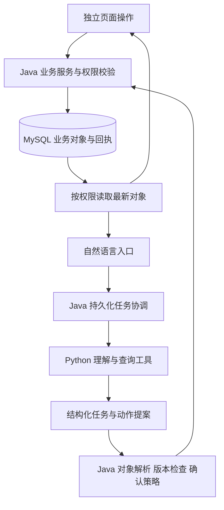

# 吃什么小程序后续开发总方案

> 本文保留初次对齐时的 v1 规划与源码快照。首批主体代码已在本地实施，以下“当前”描述不再全部代表最新状态。后续请以 [完成度复核](2026-10-06-plan-gap-assessment.md)及[总方案 v2](2026-10-06-development-roadmap-v2.md)为准。

日期：2026-10-06。源码基线：`codex/v4-meal-workspace-green-20261003`，提交 `c1525506035ca79f500d2665be0fbd01ea3d1ccd`。

建议以现有 V4 为唯一开发基线，先完成隔离验证和单餐体验，再建设跨模块 Agent。营养依赖可信数据，多餐依赖可恢复的任务执行；家庭、库存和第三方连接按实际需求进入后续阶段。保留今天、菜谱、计划、我的四个入口，Agent 与页面操作始终使用同一套业务数据。

本次交付完成本地基线对齐和开发规划。以下新增能力是待实施设计，不代表已开发、已启用或已发布。两份输入文档中的 Dot 协议、派工、部署和自动化示例均作为参考资料，本次没有据此创建任务、开启自动化或获得生产权限。

## 阅读入口和依据

| 文档 | 用途 |
|---|---|
| [本地与分支对齐报告](2026-10-06-local-alignment.md) | 分叉、旧成果保留、实际检查和迁移风险 |
| 本文 | 产品范围、核心契约、阶段、数据与发布策略 |
| [首批实施计划](../superpowers/plans/2026-10-06-v4-foundation-and-experience.md) | 环境、迁移设计、轻量修复和单餐体验的具体开发任务 |
| [验收矩阵](2026-10-06-acceptance-matrix.md) | 25 路由、跨服务故障、模型与发布门槛 |
| [输入产品方案](sources/eat-what-product-ux-roadmap-2026-10-05.md) | 产品建议原文，695 行 |
| [输入任务方案](sources/eat-what-agent-backlog-dot-charter-2026-10-05.md) | T00–T16 与职责建议原文，360 行 |
| [V4 详细设计](../eat-what-agent-fullstack-detailed-design.md) | 当前接口和业务规则；接口实现仍以源码为准 |

两份输入文件已全文阅读并原样留存。产品方案 SHA-256 为 `7227a4c3e4a1294f9a0cf331cda552682948c9ce144acbeb0213c33854a4f8c5`；任务方案为 `1d3709144e15ddc87972a59b340bdbde4a12bc7c65ebe4775f7d02273d8fe1d7`。它们引用的源码快照与此次拉取的远端 HEAD 相同。

## 当前能力与真正的缺口

| 能力 | 本次核对的源码事实 | 后续动作 |
|---|---|---|
| 当前餐 | `meal-workspace.js`、共享模板、Java 工作区与任务均存在 | 在隔离环境启用和运行验收，保护统一状态 |
| 导航和视觉 | `app.json` 有 25 页、4 Tab、15 个全局组件；已有 Token 与资产生成器 | 继续沿用，补原生适配证据 |
| 计划和实际 | `MealPlanService`、`MealConsumptionService`、独立快照和版本存在 | 降低记录负担，覆盖修改、撤销、未来日期和历史修正 |
| 采购 | 预览、来源、清单版本、手动项和原请求重试存在 | 待买优先，数量警告和来源不丢失 |
| Agent | `workspace_agent.py` 当前仅向 V4 开放四种菜品只读工具，最多四轮模型调用 | 增加受控业务动作和持久化复合任务，复用现有服务 |
| 做法入口 | `onViewRecipes()` 当前打开第一道菜 | 新增整餐做饭流程，保持单菜深链接 |
| 非业务错误 | 曝光失败写入 `feedbackNotice`，共享模板把它放进同步提示 | 与业务写入反馈分离，并保留有界诊断 |
| 版本说明 | 我的页仍为 v3.2.0，README 仍宣称热量估算 | 建立版本说明单源，明确当前能力 |
| 饮食回顾 | `DietReviewCalculator` 统计明确实际记录和分类，没有可靠营养计算 | 先改善覆盖度与证据入口，再做确定性营养计算 |
| 发布基础 | 前端和 Java 示例均默认关闭 V4；小程序基础库为 `trial` | 明确测试环境，固定经过原生验证的稳定基础库 |

本地旧进度比两份方案多出采购参考价、实付记录、腾讯语音接入和部分助手快照修复；这些已归档，不能把“远端没有”误当作“从未做过”。另一方面，旧实现依赖已替换的 V3 草稿、清单与迁移结构，也不能整包覆盖 V4。逐项承接见对齐报告。

## 产品定位和固定边界

采用两份方案提出的非商业路线，优先服务在家做饭的 1–4 人场景，保留当前 1–50 人能力。主任务是完成真实一餐：决定、确认、准备、做饭、记录、回顾。该用户聚焦仍需真实使用观察验证，不是已有用户调研结论。

必须保持以下契约：

1. 草稿、正式计划、购物清单、实际用餐是四类对象；采购勾选和做饭完成均不自动产生吃过记录。
2. 当前餐日期和餐次由用户正在处理的上下文决定；跨午夜或切后台不静默换目标。业务日期使用 `Asia/Shanghai`，时间戳统一记录明确时区。
3. 临时条件不自动变为长期偏好；人数变化不覆盖已明确设置的手动菜数。
4. Java/MySQL 负责业务身份、版本、幂等和事务。Python 负责理解、查询、提出任务和解释，不直接写业务库。
5. 所有页面和 Agent 读取同一对象；页面不复制一份“Agent 收藏”或“Agent 日历”。
6. 原请求结果未知时保留原 key、原 payload 和版本；确认冲突并重新审阅差异后才创建新请求。
7. 未知食材量、参考价格、份量、营养、用时保持未知。自由文本不能自动变成已核实数据。
8. 显示、表单、弹窗确认、轮询、网络重试及返回都校验捕获的账号与生命周期。
9. 模型不可用时独立页面继续可用；未知硬约束不能通过静默规则降级绕过。
10. 不引入自营订单、支付、配送或商业化指标。第三方采购入口以真实配置与验证为前提。

## 用户旅程和界面状态

### 四个入口

| 入口 | 默认任务 | 必须可独立到达的功能 |
|---|---|---|
| 今天 | 当前日期餐次、人数、菜单与下一步 | 修改要求、自己选菜、采购、整餐做法、实际记录 |
| 菜谱 | 搜索、筛选、看详情、选入指定餐 | 收藏、自定义、最近明确做过的菜 |
| 计划 | 默认周视图，查看和调整三餐 | 月历、复制、采购、实际纠正、回顾 |
| 我的 | 长期控制项和个人内容 | 偏好、收藏、自定义、报告、同步、数据管理、帮助 |

助手保留稳定可达入口；常见修改要求在当前餐 Sheet 内完成。旧 result/chat 路由继续兼容深链接和历史多餐导入。未经后续导航设计，不删除现有 25 条路由。

### 主动作映射

| 状态 | 唯一高强调动作 | 数据要求 |
|---|---|---|
| 空草稿 | 帮我安排这餐 | 日期、餐次、人数明确；文字可空 |
| 正在生成 | 停止本次安排 | 停止对应任务，旧结果失效 |
| 有效草稿 | 就吃这个，保存到具体餐次 | 验证工作区 revision、planVersion 与目标计划版本 |
| 条件已改 | 按新要求重新安排 | 旧方案可看，不能冒充满足新要求 |
| 需求不明 | 补充条件 | 未理解条件显示待确认 |
| 已保存计划 | 开始做饭 | 准备食材作为同屏次动作，采购不是必经步骤 |
| 做饭已完成 | 记录这一餐 | 仅记录辅助进度，等待明确实际确认 |
| 已记录实际 | 查看或修改记录 | 修正同一餐，统计不递增 |
| 结果未知 | 核对上次结果 | 原请求查询或原样重试 |
| 版本冲突 | 查看最新与本次差异 | 保留输入，禁止静默覆盖 |
| 离线 | 保留输入并在恢复后同步 | 标明本机未同步，不显示云端成功 |

优先级固定为身份失效 → 未知写入 → 冲突 → 执行中 → 业务阶段，避免“已保存”按钮掩盖未解决的请求。辅助状态不取代服务器对象，也不增加第二套方案版本。

### 整餐做饭

第一版建议新增 `pages/meal-cooking/meal-cooking`，从明确计划的日期、餐次和版本进入，展示所有菜并切换步骤。单菜详情继续承担独立浏览。优先使用计划中可信快照；如果快照缺少步骤，只在当前菜品版本一致时读取详情，否则标明需要核对，禁止混入后来改过的配方。

步骤进度首版按账号、日期、餐次、计划 revision 保存在本机，明确“仅本机”。退出可恢复，计划版本变化时提示重新核对，不能把旧步骤套到新菜单。做饭完成不调用实际记录接口。跨设备进度、计时器和常亮另做小任务，暂不承诺后台持续运行。

### 采购和实际记录

购物默认待买、按食材汇总，来源和批量操作按需展开。聚合依赖标准食材身份、规格和可换算单位；“个”和“克”没有可信换算关系就分开。仅改名称继续保留原数量警告；用户明确输入原来的数量文本也算主动核对。

“家里有”首版只影响当前采购选择，不能展示精确库存。计划变化后给出采购差异，已购或人工调整内容不自动重写。实际记录保持“按计划吃了”“实际有变化”“这餐没做”和“未记录”的区别；外食可以自由文本记录，未知分类不猜测。

## 架构与接口演进

### 原有接口继续负责业务写入

| 数据域 | 已有边界 | Agent 接入方式 |
|---|---|---|
| 当前餐 | `MealWorkspaceService`；工作区 commands/confirm | 转换为现有 `WorkspaceRequest`，保留三个版本字段 |
| 正式计划 | `MealPlanService.mutate`；`/meal-plans/{date}/{meal}` | 解析唯一餐次，已有计划先比较差异 |
| 实际与回顾 | `MealConsumptionService.save/review` | 明确实际状态；查询返回当前记录与证据引用 |
| 购物 | Preview/List/`ShoppingMutationService` | 保留 `expectedListVersion`、来源和数量可信状态 |
| 收藏 | `FavoriteDishService` | 使用“设为已收藏/未收藏”，不采用重放会翻转的 toggle |
| 自定义菜 | `CustomDishService` | 复制为用户私有副本，保留来源；需补创建幂等与并发版本契约 |
| 偏好 | `UserPreferenceService` | 只修改用户明确指定的字段；读最新值并保护并发 |

不能假定所有旧服务已经具备同样的幂等能力。T13 先审计每个动作，缺少版本或回执的服务先补共享业务契约，页面与 Agent 一起复用。控制器继续负责认证；Java 内部领域适配器调用服务时传入已认证主体，禁止采信模型提交的 userId。

### 新增任务协议

以下是 M2 拟定契约，尚未存在于当前代码。优先扩展现有任务基础设施和独立的编排记录；编排表只存执行状态与业务引用，不复制计划、收藏或清单。

`AgentTask` 包含 `taskId`、服务端主体、创建时间、输入上下文引用、任务版本、总体状态、模型/提示词版本和成本摘要。`AgentStep` 至少包含：

| 字段 | 语义 |
|---|---|
| `stepId`, `intent`, `target` | 服务端分配步骤 ID、领域动作和唯一目标；目标歧义进入补充信息 |
| `dependencies` | 仅引用本任务已存在步骤，检查循环与数量上限 |
| `operationKind` | read / analyze / write，由工具注册表决定 |
| `expectedVersions` | 工作区、计划、实际或清单的独立版本，不混用 |
| `confirmationPolicy` | none / explicitRequest / previewRequired，由服务端策略确定 |
| `requestId`, `payloadHash` | 服务端持久化，不由模型改写；重复步骤复用原请求 |
| `status` | queued / running / awaitingInput / awaitingConfirmation / succeeded / failed / outcomeUnknown / canceled |
| `resultRef` | 已存在业务对象或报告 ID，包含可供页面跳转的对象类型 |
| `error` | 稳定错误码、可重试性、用户可理解说明；不含凭据或原始堆栈 |

未确认的提案与已完成动作分开显示。确认绑定目标对象、版本和 payload hash；内容变化必须重新审阅。刷新/重启从服务端恢复步骤，不从聊天文案推断“已保存”。

复合任务按依赖图执行。数据库事务限于单个领域动作，不把外部模型调用包进事务。收藏成功、私有副本创建失败时保留成功项，重试创建步骤；“取消任务”只阻止未开始步骤，已成功动作不会被暗中撤销。回退已完成业务动作需新的明确动作和版本检查。

跨服务超时进入 `outcomeUnknown`：先读取领域回执；确认未完成才使用原 requestId 重试。失败不是成功，超时也不是失败；任务总体可以 `partialSuccess`，结果卡逐项展示。

### 三个必测复合任务

1. 保存今日晚餐并分析最近一周：明确分析“计划”还是“实际”；分析计划依赖保存回执，实际分析绝不把新计划算成吃过。没有营养数据时返回有覆盖度的饮食回顾和缺口。
2. 收藏这道菜并添加为自定义：解析唯一菜品；收藏和私有副本是独立动作；副本创建幂等，公共菜不被修改，页面立即可见。
3. 分析近期实际晚餐重复并调整明晚：分析引用原餐次；用户已明确要求调整时准备提案，覆盖已有明晚计划仍展示差异；单纯分析请求不附带写权限。

### 报告与个性化

报告首版扩展 statistics 为固定报告入口，必要时新增报告详情页；不能只存在于聊天消息。拟定 `DietReport` 保存 owner、日期范围、`basis=plan|actual`、源记录版本集合、方法版本、覆盖度、缺失项、结构化结果和创建时间。后续修改源记录时旧报告标注过期，重新计算生成新版本，不能静默改写历史结论。

明确长期设置和当前餐条件沿用现有模块。行为推断仅作为可撤销的软排序信号，含来源、置信度、创建与失效时间；不得升级为永久禁忌。首版可选换菜原因，不强制填写。不从饮食行为推断疾病、宗教或身份。

## 数据演进和旧进度承接

### 迁移血缘是首要工程任务

旧本地包含 `V3__calendar_sync`、`V4__custom_dish_receipts`、`V5__assistant_recipe_provenance`，以及未提交的 `V6__shopping_prices`。远端使用 `V3__meal_workflow` 与 `V4__meal_workspace`。版本序号重叠、表语义不同，不能认为后者自动包含前者。

后续迁移设计必须先确定目标库属于哪条历史：

| 库状态 | 处理方式 |
|---|---|
| 全新隔离库 | 用完整基础 schema 和目标分支 V1–V4 演练，验证当前集成测试 |
| 已部署目标 V4 血缘 | 核对真实 checksum、表列和索引；只追加新迁移 |
| 旧本地 V3–V6 血缘 | 基于脱敏结构与合成样本设计显式桥接，逐表映射，保留旧回执与历史快照 |
| 来源不明或混合状态 | 停止自动迁移，出结构差异报告；不得直接重跑任一套初始化 SQL |

不要修改已执行脚本或伪造迁移记录来让校验通过。新迁移编号在现有血缘核实后分配，不在此预占一个可能冲突的 V5/V7。演练必须覆盖重复执行、部分失败重入、空库/旧库、行数与关键对象校验、恢复备份。应用回滚优先关开关，保留兼容后端与数据。

### 旧成果的迁移顺序

| 旧成果 | 决策 | 完成标准 |
|---|---|---|
| 助手预算、草稿身份和快照修复 | 先提取行为契约，检查 V4 是否等价；不整体回贴旧 Runtime | 同菜不同草稿版本、重试、保存快照和外部协议回归覆盖 |
| 参考价与实付 | 新增 T17，M1 之后可单独承接，不阻断 V4 核心验收 | 适配 V4 来源和清单版本；参考价/实付分离，缺价空白，0 元有效 |
| 语音输入 | 新增 T18，T06 稳定后做可选入口 | 转写可编辑，发送需用户动作；账号切换、取消和晚到结果隔离 |
| 旧统计/同步/日历 UI | 提取可用经验与案例，不复用旧页面状态结构 | 现有 actual 口径、四 Tab 与 Token 不倒退 |
| 菜系加工资料和原始导出 | 纳入 T10 离线审计，保留原始文件 | 可复用脚本、缺失/重复/异常报告、来源可追溯 |

价格的固定业务规则：采用有来源和真实报价日期的上海零售参考价；无法获得价格时保持空白；实际支出按当前清单同一食材记录一次，不按菜品分摊，不默认建立历史账本。采购平台仅作为可选入口，分别验证配置、可达性和微信真实跳转。旧采集可用性不作为当前已验证事实。

### 食材和营养先建立可核算数据

T10 先对授权离线数据全量剖析字段、缺失、重复和异常；人工内容复核按高频菜、早餐、来源和字段质量分层抽样，报告覆盖与局限。先筛选 200–300 道候选作为建议试点规模，不能把候选数量报告成审校通过数量。

T11 拟定实体为标准食材、原始配方行、配方版本、营养来源条目、计算快照和个人确认份量。保留标准 ID、别名、规格、生熟/可食口径、数量单位、基础份数、出处、许可状态与审核状态。未知量使用空值与原因，不能用 0。

营养由确定性计算服务生成，模型只解释服务结果。可兼容单位才换算；油盐、状态不明或部分食材缺失时输出已覆盖分量和缺失项，不给整餐完整摄入标签。整餐估算与个人实际份量分开。方法和数值容差须由选定数据源、人工金标准及专业审阅决定，未确定前不发布营养计算。

每次清洗保留原件，输出新数据、可重跑脚本和审计报告。迁移或模型补全不自动使来源变得可信，也不把未知许可变为可公开使用。

## 质量体系与发布策略

### 验证分层

| 层次 | 证明什么 | 不能代替什么 |
|---|---|---|
| 静态和生成检查 | 语法、模板绑定、迁移 checksum、Token 产物 | 实际渲染和业务成功 |
| Node/Python/Java 回归 | 已编码场景的行为和契约 | 真实数据库、真实模型与微信设备 |
| 隔离 MySQL/HTTP/JVM | 事务、回执、并发、真实路由与任务恢复 | 生产 schema、原生体验 |
| 模型固定评测集 | 来源、约束、任务成功、澄清、成本和时延 | 所有开放式请求均安全正确 |
| 微信原生和真机 | 授权、键盘、安全区、字体、恢复与页面闭环 | 全量生产运营稳定性 |
| 小范围使用观察 | 找入口、理解状态、做饭和记录的实际负担 | 小样本统计显著增长 |

全链路测试必须对最终改动有效。允许复用代码和相关环境未变的证据，但要写清 SHA、环境、命令、退出码和未覆盖范围。旧文档中的 270 项不是本次全部复测结论。

模型评测先建立至少 10 个任务族，每族正常/边界/失败样本；建议起步 60 条固定样本，M2 再加入至少 30 条复合任务样本。数量是启动规模，不是质量本身。断言具体目标、保留项、禁忌、真实 ID、读写范围和最终对象，既看越权/重复写入为零，也看可满足任务成功率，不能靠一律拒绝通过。

保存模型、端点标识、参数、提示词 hash、数据版本、任务输入脱敏版、实际结果、调用数与 token 成本。真实调用须先明确测试凭据和预算；本次不使用现有生产密钥完成评测。

### 发布门槛

P0 阻断项为跨用户数据、错误餐次覆盖、重复写入、硬约束绕过、数据损失、迁移不可恢复、关键原生路径失败。非关键视觉问题需要有范围、影响和处理决定；不能用“全部通过”掩盖。

发布顺序为隔离环境通过 → 固定稳定基础库 → 原生/双设备/模型/数据审阅 → 确认迁移与恢复 → 用户批准 → 后端兼容发布 → 受控启用两端开关 → 小范围观察 → 扩大范围。生产地址、面板入口、SSH 端口及托管方式在获得具体生产授权后重新核验，不沿用旧手册操作示例。

拟增加开发/测试环境显式选择、发布配置检查与服务能力探测。生产默认关闭现有 V4，不能把本机开关打开当上线步骤。环境能力缓存按 API 和账号隔离，404 退避；仅降级不可用能力，原有页面保持可用。

遥测失败不阻断做饭和保存。诊断按 task/request ID 关联，保存状态、时延、错误码与版本，不记录自由需求全文、录音或服务密钥。未确认草稿、任务输入、行为事件沿用现有清理政策；新增报告与 Agent 记录需定义期限、删除/导出路径和业务回执保留理由，不能照搬 30/90 天到所有对象。

公开发布前安排内容/图片/营养许可、隐私说明、平台类目和适用发布要求核对；它是专门的发布任务，不以输入文档中的外部政策摘要作为永久适用结论。

### 指标和目标

北极星采用每周有效安排并明确完成实际用餐的餐次数，按账号、业务日期、餐次去重；无计划的实际记录另列。修改同餐不新增完成数，撤销后相应减少。

同时记录首次有效方案采纳率、局部调整后采纳率、有效曝光到确认、未知请求恢复率、实际记录覆盖、跨模块一致性和完成一餐的模型消耗。曝光缺失不补造事件；购物转化不要求达到 100%，已有食材的用户可以跳过采购。

规则 P95≤3 秒沿用现有设计目标；自由文本约 14 秒/四轮是当前执行预算，不是用户端 P95。先测冷/热启动、排队和弱网，再定义真实模型、端到端和首屏的 SLA。界面触控 44×44、主按钮 48、普通文本对比 4.5:1 作为项目验收目标，必须检查运行尺寸与动态状态。

## 任务映射与推进批次

| 阶段 | 输入任务 | 核心产物 | 进入下一阶段的条件 |
|---|---|---|---|
| M0 基线与验收 | T00/T01/T02/T03，T10 第一批；新增 A01/A02 | 环境基线、迁移血缘、兼容契约、原生和模型证据 | 核心闭环安全可测，P0 为零，证据缺口有负责人 |
| M1 单餐体验 | T04/T05/T06/T07/T08/T09 | 文案、状态 CTA、同餐输入、整餐做饭、采购和实际记录 | 用户可独立完成一餐，关键新路径原生通过 |
| M2 跨模块 Agent | T13/T14，偏好软信号 | 领域工具、任务步骤、结果卡、报告和双路径一致性 | 三个基准复合任务通过，部分失败和恢复可靠 |
| M3 可信营养 | T10/T11/T12 | 审校配方、确定性计算、版本快照与覆盖提示 | 金标准与专业审阅通过，未知值和口径清楚 |
| M4 指定多餐 | T15 | 首批指定三天晚餐、保留/跳过/部分确认、采购差异 | 取消和恢复不重写旧计划，不重复采购 |
| M5 可选扩展 | T16 | 家庭授权、轻量库存或第三方连接的验证方案 | 有真实需求，独立权限/数据边界和退出路径 |
| 本地成果承接 | T17 价格实付、T18 语音 | V4 适配与独立开关 | 通过原业务契约及 V4 身份/版本验收 |

A01 是迁移血缘与桥接设计；A02 是本地旧功能契约回归与能力兼容。两者由本次分支比较新增，不能被“全新隔离库 V1–V4 通过”覆盖。

依赖关系：T00 → T01/A01/A02 → T02/T03；T04 可先完成；T05 → T06/T07；T08/T09 依赖隔离基线和对应原生能力；T13 → T14 → T15；T10 → T11 → T12。T13/T14 不等待营养；T15 也不强依赖精确营养，价格/库存无可靠数据时不作为硬优化条件。

建议的实际工作批次为：B1 环境和文档、B2 迁移/契约验证、B3 原生/模型基线、B4 当前餐 CTA 与同餐输入、B5 做饭/采购/实际、B6 跨模块只读与少量写动作、B7 复合任务恢复和报告、B8 数据营养与指定多餐分别推进。每批可验收、可回退，不把后续所有阶段合成一个大 PR。

不虚设上线日期。B1/B2 完成后根据本机、真实设备、模型预算和数据质量确认排期；每个迭代以一个可独立验收的用户结果收尾。

## 责任和执行边界

Codex 负责已授权范围内的实现、适用测试、差异和文档；用户负责产品取舍、设备/数据权限、模型费用预算和生产发布决定。真实设备验收由有设备访问条件的执行者完成，不能交给没有原生环境的执行者后宣称通过。

Dot 如后续接入，可维护上下文和汇总问题；具体客户端能力、连接权限、额度和调度在接入时核验。本次没有启动 Dot、派发新聊天、建立定时任务或推送/合并 GitHub。

首个实施任务应是[首批计划](../superpowers/plans/2026-10-06-v4-foundation-and-experience.md)中的 B1：让干净环境稳定复现现有回归并修正文档事实。先解决可复现与验收基础，再修改用户主流程。
