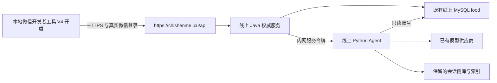

# V4 线上升级方案

状态：**方案已准备，未执行生产升级。** 用户选择保持 V4 开启，先准备线上升级，不切回旧版兼容预览。

本次的目标是让本地微信开发者工具通过现有 HTTPS 入口访问线上 V4，并使用真实菜库和本人历史。数据库仍由线上 Java 服务访问，小程序不保存数据库密码，也不直接连接 MySQL。部署、迁移、服务重启和线上测试写入须在具体候选包与迁移差异可审阅后取得授权。

## 当前证据与边界

2026-10-07 未携带用户 token 的 GET 探测：

| 项目 | 当前结果 | 能说明什么 |
|---|---|---|
| `https://chishenme.icu/api/actuator/health` | 200 | 公网入口及健康端点可达，不证明全部业务可用 |
| `/api/dishes/count` | 401 | 请求进入了需要认证的接口；未读取线上菜品数量 |
| `/api/meal-workspaces/current` | 404 | 当前请求不能使用 V4 工作区；部署版本、路由或开关原因待服务器确认 |
| `/api/recipe-records/overview` | 500 | 正式总览路由的匿名探测失败；未确认登录后的结果与错误原因 |
| `/api/diet-reviews` | 404 | 当前请求不能使用该新接口 |
| `/api/assistant/sessions?limit=1` | 500 | 历史列表匿名探测失败；未确认后端版本与日志 |
| `/api/shopping-list/purchase-options` | 401 | 需要认证；未确认价格、实付、平台能力 |
| SSH 3294 | 连接拒绝 | 仓库记录不能作为当前可用端口 |
| 用户提供的 SSH 8004 | 连接超时 | 还不能取得当前 JAR、配置、MySQL 结构与容量清单 |
| 服务器面板 33454 / MySQL 3306 | TCP 可达 | 仅确认端口连通，未登录面板或数据库，不证明身份与安全连接条件 |

本地 `recommend-service/.env` 的数据库地址是 `127.0.0.1:3306/food`，账户名为 `food_reader`；密码与模型配置存在但不输出。这是服务部署在服务器上时的本机数据库地址，不是 Windows 访问远程数据库的地址。当前本地 Java 使用 `.local-v4/application-local.yml` 中的独立数据库；正常生产外部配置应以服务器实际运行文件/环境为准。

源代码基线为 `faf3dd77d111b4370272d15df2aac54e60541447`。已验证前端 210、Python 41、Java 65，共 316 个测试；44 WXML、45 WXSS 官方编译通过。已完成新建合成库的失败/恢复演练，**尚未证明现存生产库能升级**。上一版本机与 GitHub 仅源码内容对齐、提交身份不同，不自动重置或推送。

现有本地 JAR 为 32,427,648 字节，SHA256 `68e0cdfcad1e37cbd7053ac1e26432e87c767c0b1f3a4dcf3886144ff57fcac0`。它只是受测基线，生产入口差异与真实库兼容性完成前，不能作为最终部署包。

## 目标连接与职责

运行路径暂按 `SERVER.md` 的 `/www/wwwroot/backend`、`/www/wwwroot/recommend-service` 作为待核对候选。Java 8080、Python 8000 回环监听、宝塔管理 Java 与 systemd 管理 Python，均须重新实测；旧部署脚本、通配进程终止、历史内存与行数不作为执行依据。

上线验证前保留当前已验证的本地配置，V4 不关闭。线上目标明确为 `https://chishenme.icu/api`；确认后端与数据库就绪后，同一批将 `utils/config.js` 切换到该地址、保持 `ENABLE_MEAL_WORKSPACE=true`，再生成新的本机微信调试包。不会把目前不可用的新接口当成已经联通。

## 必须先补齐的生产差异

1. **生产 Agent 与本地验证入口一致。** 当前 `local_agent.py` 注入推荐元数据并区分执行失败，生产 `main.py` 的 `/internal/v4/meal-task` 尚未完全一致。应共享目标/来源/限制验证，向模型提供同一枚举元数据；超时、坏 JSON、预算失败返回独立执行失败标记，不冒充正常澄清。Java 仍决定是否接受草稿和写计划。
2. **建立面向现存库的桥接迁移。** V3 有直接 `ADD COLUMN`/`CREATE TABLE`，V4 会插入六道命名兜底菜，不能无差别重跑。生产保留既有菜库、ID、归属、菜单、收藏、购物和实付；不导入本地 6,665 条替换文件、不插入本地十道样例或六道兜底菜。派生索引重建不能重建业务数据。
3. **补齐配置和运行目录。** Java/Python 的 `MEAL_WORKSPACE_SERVICE_TOKEN` 必须一致且非空；`MEAL_WORKSPACE_ENABLED` 在结构与服务就绪后启用；模型密钥、微信 AppSecret、Token Secret 和读库密码沿用经核对的服务器私密配置。生产使用 `main:app`，不部署仅允许隔离库的 `local_agent:app` 或 `local-v4` Profile。语音保持关闭；价格采集保持关闭，未验证报价保持空缺。
4. **隔离切换环境后的本机状态。** 保留旧本地草稿和未知请求，但不能把它们发送到线上同 ID 的账号。缓存、待确认操作、请求重放与会话交接须核对 API 环境、用户、日期餐次和版本。切环境只清理失效认证，不执行全量清空存储。

## 数据审计与迁移口径

只读清单先收集 MySQL 版本、表/列/索引/引擎、迁移记录及指纹、对象数量、外键关系；统计重复业务键、缺失字段、失效关联、未知单位/类别、菜单 JSON 解析失败、日期/餐次异常、实付键冲突。核对源字段语义后才能决定转换规则。

- `fresh`、已有 V4、旧 `V3__calendar_sync` / `V4__custom_dish_receipts` / `V5__assistant_recipe_provenance` / `V6__shopping_prices`、混合或未知血缘分别处理；不能仅凭迁移名或 `CREATE TABLE IF NOT EXISTS` 宣称兼容。
- 现有 `schema_migrations.migration_fingerprint_sha256` 是描述指纹，不冒充迁移文件 SHA。新增桥接文件记录自己的规范化文件哈希与分步执行回执，旧账本不改名、不重写历史。
- 缺列/缺索引只做经审阅的增量；冲突列类型、同名不同表结构、唯一键重复须先解决桥接规则，不能强行覆盖或删除行。
- 历史菜单不自动计为已吃；actual 只来自已有明确实吃记录或用户的新确认。份量、类别、价格不推测，不以 0 填未知；实付按当前清单稳定食材键保留一次，0 元有效。
- 生产全量备份含 MySQL、JAR、私密配置、Python 发布包、助手 SQLite 主库及其一致快照、必要会话/索引路径。索引可重建，会话与业务记录不可当成缓存丢弃。

在副本保留结构、ID 与关系，个人数据按演练需要脱敏，使用合成测试账号写入。备份必须有哈希、可恢复证明和原件保留。DDL 部分执行失败按分步回执与结构复核恢复；不宣称 MySQL DDL 可整体事务回滚。

## 分阶段执行与批准范围

| 阶段 | 交付/验收 | 是否涉及生产写入 |
|---|---|---|
| A 当前方案 | 连接证据、代码差异、升级任务、验收与恢复门槛 | 否，已完成 |
| B 只读清单 | 当前服务器/配置/DB 结构与容量事实 | 否；SSH 通道尚未恢复 |
| C 本地实施与副本演练 | 生产入口一致、桥接 SQL、恢复结果、最终 SHA 包清单 | 只写隔离副本，不写生产 |
| D 生产批准 | 明确目标路径、迁移差异、数据影响、测试账号、维护窗口、恢复点 | 在全部材料具体可审阅后提出 |
| E 后端升级 | 冻结业务写入、最终备份、批准迁移、Python/Java 受控切换与重启 | 需要 D 的明确批准 |
| F 本地线上体验 | 切换 HTTPS/真实微信登录，V4 开启，逐页验收 | 只有批准测试账号的限定业务写入；不自动发布微信版本 |

本轮只完成 A。B 的只读核对已被用户授权，但连接仍有阻塞；C–F 不因本文存在而自动执行。若现机容量不足，不在旧文档所称的小内存机器叠加常驻第二套 JVM；先确认真实容量，选择离线副本演练或另行批准的测试环境。

## 发布和验收标准

最终包固定源码 SHA、JAR/Python/前端/迁移哈希、依赖锁定、配置键清单与原服务器备份指纹；不使用 `>=` 依赖在生产上临时升级到未知新版本。私密文件、数据库、助手会话、`venv`、日志和本地样例库不进入源码包。

先把新后端部署在 V4 开关关闭状态并验证原有登录/菜库/收藏/购物；在数据库就绪、内部令牌正确、规则路径可用后，启用服务端 V4，再切换本地前端。Python 内部端点不增加公网代理，保留已有公开聊天兼容路由。

验收必须用正常微信登录后的指定账号，不能伪造 production token、创建本地免登录账号或使用他人账户。读验收与写验收分开登记；写验收批准日期/餐次/对象，记录所创建对象，清理也遵守原版本和数据边界。

- 菜库/历史：实际在线菜品数量与受审计基线一致，本人旧记录可读，无六道示例污染，无跨账号内容；历史分页与导入重新核对源版本。
- V4 正常闭环：规则生成、需求、锁菜/换菜、确认、做饭、购物、价格空缺、实付、实际记录和回顾；已购/做饭不自动变已吃，计划被替换时展示新旧菜品并阻断按新计划误记。
- 故障闭环：同 key 重放不加记录、改 payload 拒绝、两设备 stale 冲突、取消后的迟到结果、重启恢复、提交后响应丢失、A/B 切换、弱网、服务器暂不可用。
- 原生：27 页真实入口与返回，至少 iOS/Android、320 逻辑 px、大字、键盘、安全区、长菜库/购物清单，修复 EPERM 与图标加载问题；源码/编译通过不替代实际连接与交互。
- 模型：当前代理联调累计 15/20，剩余最多 5 次供应商请求，失败也计数。先用规则与离线 60 样本验证；生产端无法强制记录和限制联调用量时，不自动执行真实模型测试。不重置预算，不将供应商故障算成理解成功。
- 基础库：在实际可连接环境选验收过的稳定版本后替换 `trial`，不直接认定灰度 3.17.3 可发布。

## 恢复策略与停止条件

旧应用回滚和数据库回滚分开。若只有应用问题，先关闭新增写入口/V4，再切回已验证兼容的旧 JAR/Python；保留新增列和记录。旧后端如果不识别软删除/actual/购物版本，不能直接开放其写入。

若已发生错误写入或结构损坏，冻结写入，保留故障现场并按批准恢复点恢复。上线后的合法新增记录须先保留/核对，不能用整库恢复静默丢失。恢复后的数据、路由、登录、对象数量、读写权限与回执都要复验。

以下任一出现即停止向下一阶段推进：SSH/目标身份未确认；备份不可恢复；血缘混合未知；数据语义或唯一键冲突未处理；容量不足；缺少内部令牌/读库权限；基本服务回归失败；原生写入存在重复/跨账号；需要超预算模型调用；需要未批准的权限、网络或数据覆盖。

实施步骤见 [升级实施计划](../superpowers/plans/2026-10-07-online-v4-upgrade.md)。当前连接检查原始证据在私有 `work/v4-closeout/online-probe-correct-routes.json`，没有记录 token、密码或个人记录。
