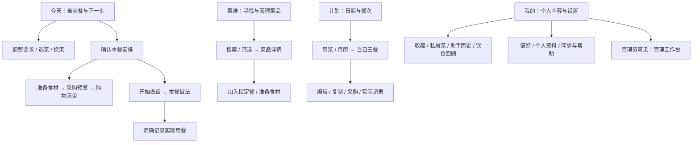

# 吃什么 V4｜全页面 UI / UX 美化总方案

日期：2026-10-07。状态：设计提案，未实施。源码核对基线：`faf3dd77d111b4370272d15df2aac54e60541447`。

**用户已选定的方向：温暖餐桌感。保留深绿品牌，让食物、清晰的阅读顺序和顺手的操作成为主角。**

用户补充要求：首页没有作用的星星简笔画很突兀，需要把全小程序同类元素找全并重新设计。明确决定：移除 V4 标题右侧的无交互星星，不用另一幅装饰替代、不为了保留它而硬加功能。逐项处置见[全量装饰与无效元素审视](../../ui/2026-10-07-decoration-audit.md)。

本方案响应“先不管线上指标，制定覆盖全页面、全功能的成熟美化方案”。本轮只生成设计与实施材料，不改小程序业务代码、接口配置或线上环境。当前 V4 开启、语音暂不可用等已确认决定继续有效。

配套材料：

- [27 页与全功能覆盖矩阵](../../ui/2026-10-07-full-page-experience-matrix.md)
- [视觉方向与关键页面概念预览](../../ui/2026-10-07-ui-direction-preview.html)
- [分批实施计划](../plans/2026-10-07-ui-ux-redesign.md)

## 1. 我们要做成什么样

面向日常在家做饭的人，尤其是工作日晚餐的 1–4 人场景；这是产品聚焦假设，不是用户调研结论。保留 1–50 人的能力。打开应用，能看清正在安排哪一餐，很快得到可调整的菜单，然后顺畅进入采购、下厨和实际记录。

设计关键词：**自然、安静、有食欲、易读、可靠**。成熟感来自信息和行为有主次，而不是堆更多组件、图标、动画或说明文字。

### 三种方向的取舍

| 方向 | 优点 | 代价 | 本方案选择 |
|---|---|---|---|
| 温暖餐桌感 | 食物内容有吸引力；暖白与深绿能承接现有品牌；工具操作仍清楚 | 需要认真处理菜图质量和缺图布局 | 推荐，作为第一版提案 |
| 清爽专业工具感 | 密集列表、管理页面效率高 | 消费端容易继续像表单工具 | 用于采购、后台等高密度任务 |
| 活泼轻插画风 | 空状态与引导有亲和力 | 大面积使用会幼稚，稀释菜品内容 | 仅用于少量品牌状态 |

不把餐饮内容、清单效率、后台管理强行套进一种页面模板。统一的是字体、间距、颜色、反馈与组件语法；页面布局按任务区分。

## 2. 现状审视：机械感具体来自哪里

以下为当前源码和图标资产的审视，**不是本轮微信真机缺陷复现**。历史截图不能代表当前 V4。

| 发现 | 当前证据 | 对体验的影响 | 设计处理 |
|---|---|---|---|
| 三个入口视觉职责接近 | 今天、结果、聊天的 V4 分支均 include `templates/meal-workspace.wxml` | 切换入口却仍像同一张操作表单 | 同一餐数据继续共享，展示分别承担总览、方案决策、需求补充 |
| 餐单以文字行和按钮为主 | 工作区菜品行展示 recipe 图标、名称、保留、换一道；没有菜图位 | 用户首先看见控件，食物缺乏吸引力 | 建立一组有主次的餐单内容；提供无图也完整的布局 |
| 相近入口重复露出 | “修改要求 / 语音”“继续说需求”“历史 / 高级助手”等 | 用户要先理解功能名称，才能决定怎么点 | 统一“调整这餐”“补充要求”“助手历史”；语音只留在输入区 |
| 按钮视觉重量接近 | `ui-button` 主要为 primary/secondary/danger；部分列表每项多按钮 | 小操作占用与主动作相似的空间 | 增加文字动作、轻操作和明确的上下文动作栏 |
| 购物条目被卡片切碎 | 食材各占卡片，费用、来源、改量分多行 | 买菜时扫描和勾选效率低 | 连续清单行；数量紧邻名称；费用和来源按需展开 |
| 图标统一但不够精修 | 36 个语义名、40 个变体由简单 path 生成；选中态共用路径填色 | 今天图标外观偏盒状；书本选中态黑度重；语义区分有限 | 单一成熟基础图标库，加少量专门绘制的餐饮品牌图标 |
| 历史图标绘制规则仍在 | `design/wxss/app.tpl` 含 `.line-icon-*` 伪元素；当前组件用 PNG | 存在两套来源，可能叠加；是否发生须逐调用点验证 | 先查引用再清理，禁止盲删旧兼容视图 |
| 提示信息常驻偏多 | 实际记录、采购、同步页含较多解释性正文 | 正常操作也像在阅读说明书 | 常态保留一句必要解释，风险发生时就地说明具体影响 |

### 图片条件核对

本机 `outputs/dish-replacement-20260718/food_import.csv` 有 6,665 行，每行 `image` 为不同的 HTTP(S) 地址；`step_images` 全部为 `[]`。这仅证明本机历史导入文件有封面引用，**不证明当前运行库已导入、图片可访问或具备复用授权**。本轮未下载这些图片、未访问线上菜库。

因此：封面图采用现有已确认可用且有来源的资源；没有图时切换紧凑文字版。步骤以清晰文字为默认，不给每一步虚构配图。不将其他 App 的菜图、截图或品牌资产加入本产品。

## 3. 商业产品参考：借鉴什么，落实在哪里

调研日期：2026-10-07。依据为官方产品介绍、帮助页及其公开展示内容，不是登录后逐功能实机测试；本节的落地选择属于设计判断。

| 参考 | 官方可核实的产品做法 | 吃什么的借鉴方式 | 不照搬的部分 |
|---|---|---|---|
| [下厨房](https://www.xiachufang.com/app/) | 围绕菜谱、烹饪内容和生活方式组织产品 | 菜品标题、真实食物内容和自然中文文案承担情绪表达 | 社区流、商业推广、排名热度；没有真实数据就不显示“万人做过” |
| [Kitchen Stories](https://pages.kitchenstories.com/en/app) | 食谱发现、收藏书册和逐步 cooking mode | 详情页的阅读节奏、食材/步骤分段、做饭时突出当前步骤 | 海外订阅结构；未具备的高清视频、营养能力 |
| [Paprika](https://www.paprikaapp.com/) | 菜谱、计划、分类采购、步骤标记与烹饪时切换菜谱 | 稳定的任务路径、可恢复的做饭进度、采购清单效率 | 自动单位换算、计时器等未实现能力；保留本项目未知量规则 |
| [Apple 提醒事项采购清单](https://support.apple.com/en-gb/105086) | 清单条目按类别组织，可修改类别 | 行式勾选、待买优先、细节按需查看 | 不新增智能分类服务；只有已有可靠分类时才分组，否则按名称展示 |

补充参考：[Mealime](https://www.mealime.com/) 的 Plan → Shop → Cook 路径适合研究任务连续性。官网本次核对已公告将于 2026-10-21 停止服务，因此只作历史交互参考，不作为接入推荐或持续运营标杆。

图标基础候选为 [Lucide](https://lucide.dev/license)，使用前固定版本与来源，保存 ISC 及派生图标所需的 Feather MIT 声明。比较的是语义与光学质量，不以“用了某图标库”作为美观验收。

## 4. 信息架构与入口层级

保留四个底部 Tab：**今天 / 菜谱 / 计划 / 我的**。不增加第五个“AI”入口，也不让购物清单依赖聊天才能找到。

### 四级入口规则

| 层级 | 内容 | 位置与要求 |
|---|---|---|
| 一级 | 今天、菜谱、计划、我的 | 原生 Tab 持续稳定；二级页使用正常返回路径 |
| 二级 | 购物清单、当前餐、菜品详情、饮食回顾、收藏、私房菜 | 今天右上角固定“清单”文字入口，有待买时显示计数；计划和我的提供同一路由快捷入口 |
| 三级 | 调整本餐、筛选、份量核对、实际记录、编辑实付 | 使用就近 Sheet 或明确编辑页，不跳出当前餐上下文 |
| 四级 | 删除、清空、重置、诊断、管理操作 | 更多菜单或管理分区；标明对象与影响；不靠长按或隐藏点击发现 |

“助手历史”在我的个人内容组常驻，也可从补充要求区域进入。现有 `chat`、`result` 路由保留以兼容返回和旧链接；它们展示不同任务视图，但不得新建另一套餐单状态。

## 5. 视觉系统：明确到能实施

### 5.1 色彩

| 角色 | 建议值 | 使用方式 |
|---|---|---|
| 主品牌绿 | `#28634E` | 当前主按钮、选中、少量强调 |
| 按压深绿 | `#20513F` | 主按钮按压态，新增 Token |
| 品牌浅底 | `#EDF3ED` | 已选条件、轻状态，避免铺满每个模块 |
| 页面暖白 | `#F8F7F2` | 主要背景，保留现有品牌 |
| 内容白 | `#FFFFFF` | 必要的任务容器、表单、弹层 |
| 正文 / 次文字 | `#25332B` / `#617066` | 正文、必要说明，不降低透明度制造“高级灰” |
| 装饰边界 | `#D9E1D5` | 弱分割；不能单独承担输入框/选中等关键识别 |
| 控件边界 | `#7C8E80` | 未选 checkbox、必要输入边界，新增 Token 并逐背景检查 |
| 暖色点缀 | `#A45C3A` / `#F4E4D5` | 少量季节性内容/插画，不用于第二套主按钮 |
| 危险 / 警告 | `#A93B30` / `#75501A` | 使用文字和图形补充语义，不仅变色 |

只在原设计 Token 单源中扩展语义，禁止每页新增近似色。所有拟议颜色仍需在最终控件真实背景上验证。

### 5.2 排版、空间与容器

- 系统字体，中文优先 PingFang SC / 系统无衬线；不把艺术字用于正文。
- 页面标题 24px，重点展示标题最高 28px、每屏最多一次；区块标题 18px；菜名和阅读正文 16px；辅助 13px；标签 12px。普通说明 14px。增加 `reading` 与 `display` 语义 Token，不全局强行放大所有文案。
- 常规正文行高 1.5–1.6，做法正文 1.65；字重只使用常规与中等/加粗两个主要层级。价格使用等宽数字，中文菜名不字间拉伸。
- 页边距 16px；宽屏可 20px；区块间距 24/32px；行内间距 8/12px。窄屏先换行或纵向布局，不缩小关键文字。
- 主内容容器圆角 18px；弹层顶部 24px；按钮 14px；缩略图 10/14px；状态 Chip 才用胶囊。卡片内部不再嵌套卡片。
- 默认无阴影；只有浮起的操作栏/弹层使用轻阴影。连续清单使用分组与细分隔，避免每一行一个大盒子。

### 5.3 图片与无图设计

- 餐单：有可信封面时以 72–88px 的方形缩略图配菜名；可选一张主菜图承担视觉重点，但不强求每餐有大头图。
- 菜谱浏览：以 4:3 图片内容卡为主，选菜模式使用一列紧凑列表，避免两列中的长菜名与操作争抢空间。
- 详情：封面 4:3；名称和操作不压在食物上；收藏触点有稳定底色。
- 缺图：直接使用文字版菜品行和很小的餐盘占位，不重复“菜图稍后补上”大面积占屏；错误图片不重试闪烁。
- 不凭空增加评分、收藏数、卡路里、食物认证标签。无可靠用时显示“用时未记录”或省略该字段。
- 图片资源后续单独登记来源、许可、尺寸与用途；保留现有来源信息。设计预览使用明确标注的示意素材。

## 6. 图标专项方案

### 6.0 先判断需不需要，再决定画成什么样

一个元素至少承担内容识别、状态解释、操作指引中的一项，才适合进入常规任务界面。纯品牌装饰仅在有限的首次引导/空态中存在，不能挤占主要内容。没有点击行为不等于无用：菜图、日期状态、来源说明有信息价值；标题旁固定星芒、没有含义的圆点与重复图画则移除。装饰图形不伪装成按钮，不为装饰新造交互。

### 6.1 风格与数量

基础图标从一套库选取，24×24 画布、2px 圆头圆角描边、至少 2px 安全区。20px 图标进行独立小尺寸审视；只有统一的光学校正规则才允许局部变化，不逐个随意变细。

保留当前 36 个语义名和别名兼容；优先替换图形，不一次改遍业务调用。新增图标必须有实际使用场景。功能图标不用 emoji，不把每个文字标题配一个图标。

| 场景 | 推荐语义 | 具体调整 |
|---|---|---|
| 今天 | 餐碗或餐盘 | 去掉像文件盒的矩形轮廓；与计划日历明显区分 |
| 菜谱 | 打开的书 | 减少内部线段；选中时保留中缝和内容留白 |
| 计划 | 日历 | 日历格数克制；选中与未选中视觉面积一致 |
| 我的 | 人物轮廓 | 头肩比例统一，避免填色后成为不明色块 |
| 购物清单 | 菜篮 | 线条简洁，在 20px 仍能识别；保留“清单”文字 |
| 换一道 / 换一套 | 切换箭头 / 环形箭头 | 保留动作文字；不混用同一星芒 |
| 保留菜品 | 锁定或图钉 | “保留”与“收藏”分开，已保留显示文字状态 |
| 收藏 | 心形 | 已选使用专门的实心轮廓，不用普通路径一键灌色 |
| 助手 | 小星芒配文字 | 仅用于助手入口和任务反馈，不散布在普通操作里 |
| 语音 | 麦克风配“暂不可用” | 点击仍按约定弹窗；不申请麦克风、不启动服务 |

原有五类插画只在首次空态或关键完成态使用；正常列表无插画。完成反馈不每次弹出大幅成功图。

### 6.2 交付与验收

交付 SVG 母版、适配微信运行的 PNG、资源清单、许可文件和 20/24/32px 图标对照板。原生 Tab 使用独立设计的选中变体。深绿与次文字色分别输出；品牌 PNG 不尝试依赖 CSS `color` 变色。

生成链路仍为 `design/tokens.json` + 资产定义 → 生成 WXSS、PNG、`utils/ui-assets.js`。先核对 `.line-icon-*` 全部调用点再移除冲突绘制。每个图标检查黑度、重心、边距与可识别性；未知语义回退不得成为静默遗漏。

## 7. 按钮、表单与公共交互

| 类型 | 表现 | 适用动作 |
|---|---|---|
| Primary | 深绿白字，最小 48px 高，14px 圆角 | 就吃这个、确认加入、保存实际；当前活动视口原则上一个 |
| Secondary | 浅绿或白底，44px 触点 | 调整这餐、查看安排、取消编辑 |
| Text / Tertiary | 无大色块，文字清晰，44px 触点 | 换一套、撤销、查看来源 |
| Icon action | 20/24px 图形放进至少 44×44px 点击盒 | 返回、关闭、更多、收藏；具有可访问名称 |
| Destructive | 文字危险色，进入确认时才高强调 | 删除计划、清空清单、停用用户 |

按钮统一 default / pressed / loading / disabled / selected 适用状态。loading 保持宽度和文案，不重复触发；disabled 必须能解释原因。页面无需主按钮时可以没有，例如回顾和历史浏览，不能为了统一强造一个。

表单使用“可见标签 → 输入 → 一行帮助或错误”，不靠 placeholder 承担标签。必填与可选明确。保存失败保留输入，取消不提交。软键盘出现时确认按钮可达，关闭手势不吞掉未保存内容。

弹层同一时刻只有一层；从 Sheet 进入下一任务时关闭/替换当前层，返回恢复已填内容。原生返回与页面返回遵守同一规则。触发业务修改的按钮不用滑动或长按作为唯一入口。

### 反馈时序（设计目标，不是已测性能）

- 点击立即出现按压反馈；等待超过约 300ms 显示局部 loading，列表初次加载可用骨架。
- 普通过渡 160–200ms，弹层 220–260ms；不做循环浮动、过度弹跳和等待期间伪进度百分比。
- 模型任务显示真实已知阶段与“停止”，未知时长不编造倒计时。
- 勾选先响应，但失败明确回退；结果未知时显示“正在确认”，不能先宣布成功。
- 复杂写入成功使用就地回执；轻量收藏可短 Toast。破坏性清空保留原确认，不因美化删除安全反馈。
- 遵循系统减弱动态效果设置；降级为无位移动效。

## 8. 核心页面与关键状态

### 8.1 今天：把一餐呈现在用户面前

首屏顺序：今天与清单入口 → 日期/餐次/人数 → 本餐内容或简短空态 → 条件摘要/调整 → 当前主动作。长说明和高级菜数不抢首屏。

空态提供一句可编辑的需求输入与“帮我安排这餐”；已有方案时收起大文本框，展示菜品和两个最高频的局部操作。多个菜品组成一个餐单，不每道各套一张外卡。

| 状态 | 页面主体 | 主动作 | 保持可见的次动作 |
|---|---|---|---|
| 未决定 | 简短需求输入、人数/餐次 | 帮我安排这餐 | 自己选菜 |
| 正在安排 | 原菜单保留，局部阶段反馈 | 停止本次安排 | 不触发第二个生成 |
| 有草稿 | 菜单、已确认条件、必要原因 | 就吃这个 · 明确日期餐次 | 调整这餐、单菜保留/替换 |
| 已保存计划 | 菜单加“已安排”标签 | 开始做饭 | 准备食材、记录实际 |
| 已记录实际 | 实际菜品、记录时间及必要状态 | 可无强 CTA；查看/修改记录 | 重新安排须另行明确操作 |
| 结果未知 | 保留原内容与待确认状态 | 核对并重试同步 | 查看本次内容 |
| 冲突或计划变化 | 最新内容和本次输入的区别 | 查看最新安排 / 核对差异 | 保留输入后重新确认 |

不根据“现在很晚了”自动变成已经吃过。跨天时明确区分今天入口与用户仍在编辑的旧日期。

### 8.2 菜谱与详情：浏览和选菜是两种任务

浏览态：搜索固定在上方，分类一行，内容图卡为主。筛选放 Sheet，已应用的摘要保留。选菜态：顶部明确目标日期餐次，单列内容加选择按钮，底部“已选 2 道 · 加入今晚”。点菜品内容看详情，点加号只选中，不混淆。

详情顺序为封面、菜名/收藏、可靠信息、食材、步骤、小贴士/来源。唯一主动作依进入上下文确定：加入指定餐、准备这道菜的食材，或查看本餐做法。不是每个入口都同时出现三个大按钮。

### 8.3 计划与餐次详情：像安排日程一样明确

默认周览，可切月历；日期位置稳定。当天三餐按时间排列，计划与实际各有文字标签；缺记录与取消安排分开。顶部设置采购范围，日/周/月范围写进采购入口文案。

餐次详情保留编辑、从菜谱选菜、复制、采购、删除、实际记录/撤销全部能力。主要操作随是否有安排/实际变化；低频操作放更多。复制展示来源与目标，替换须再次核对。

### 8.4 采购：像一张好用的购物单

采购预览先交代“为哪几餐、几个人准备”，再列食材。已有食材可去除；未知量就地提示并可编辑；底部只突出确认加入。

清单默认待买，勾选居左，名称与数量同行；来源、备注、实付入口进入行详情。费用摘要仍可发现：“参考价 / 本次实付”并列，缺价不补零。支持按餐次切换以核对来源，但不连续摆两排同重量的 Tab。

“手动添加”“从菜谱添加”归为一个明确的添加入口；“复制待买”“清空已买”“清空全部”进入更多菜单，各自保留原处理和确认。叮咚/盒马入口仅在原能力配置允许时呈现；不伪造跳转成功。

### 8.5 下厨与实际记录：操作少，文字大

做饭页顶部菜名切换支持长名滚动/换行，当前步骤使用 18px 或随系统放大的阅读字号。下一步作为主要动作，上一步弱化。离开再进保留各菜本机进度；不会把这些进度写成实际吃过。

做饭结束后由用户打开实际记录。Sheet 先选“按这份计划吃了”或“实际有变化 / 外食”，再出现对应内容，最终只出现一个确认保存动作；显示日期餐次。计划已变更时对照展示并保留输入；未来日期不能确认吃过。

### 8.6 助手、我的与支持页

助手是当前餐的表达通道：上方固定餐次摘要，下方输入；适度展示已理解的条件，未理解文字不能假装“已应用”。历史按时间分组，先浏览、再明确导入指定餐，历史本身不写当前餐。

我的使用头像与昵称 + 个人内容列表 + 设置支持列表。登录以用户主动操作或能力需要触发，取消后不循环追问；保留游客可用路径。偏好区分长期与本餐，硬排除不可被一键清筛选暗中清掉。

回顾围绕实际餐次和记录覆盖，图表留白充足、含口径与证据入口。同步页清晰分出已确认、待重试、需核对；普通页只显示简短状态，诊断详情留给支持页。

### 8.7 管理端：同品牌，更高信息密度

六个管理路由仍全部覆盖。用紧凑列表、搜索和状态标签，普通用户看不到入口。停用、发布、下架、删除前显示目标名称和影响；弹窗失败保留输入，列表刷新位置尽量保持。旧 `admin` 路由保留兼容入口，不能因有新工作台而漏掉已有代添加菜品等能力。

## 9. 文案：自然但不能含糊

| 现有表达或问题 | 推荐表达 | 保留的信息 |
|---|---|---|
| 修改要求 / 语音 | 调整这餐 | 进入后才见文字与语音方式 |
| 历史 / 高级助手 | 助手历史 | 不把两个任务合成一个名称 |
| 按原保存请求重试（技术表达） | 确认刚才是否保存成功 | 内部仍使用原请求标识 |
| 保存到云端 | 保存食材 / 保存偏好 | 对象明确；未确认时不能宣称已保存 |
| 数据为空 | 还没有安排这餐 / 还没有待买食材 | 与网络失败区分 |
| 单一“操作失败” | 这次没有保存成功，内容已保留 | 给具体可恢复动作 |

语音弹窗固定为：**抱歉，该功能暂不可用**。不改成“正在开发”等不同承诺。用户真正需要核对的数量、日期、报价日、价格来源仍直接可见。

## 10. 全功能不能在美化中丢失的契约

1. 同一餐工作区、归属、版本冲突、原请求重试、跨账号晚到结果隔离全部保留。
2. 保留/换一道/换一套/撤销/手动菜数/整餐时间/临时要求/长期偏好均有可发现入口。
3. 保存计划、加入采购、勾选已买、记录实付、确认实际是五类不同操作，不顺手连写。
4. 上海零售参考价展示真实报价日期；缺价保持空值。实付按当前食材汇总一次，0 元有效，不按菜分摊，与已买独立。
5. 计划不等于实际；缺记录不等于没吃；不从菜名推测营养。历史步骤缺失时不补写做法。
6. 语音服务继续空置；点击弹窗，不申请权限、不产生模型请求。
7. 用户禁忌不被筛选重置、智能推荐或零结果恢复偷偷放宽；表单取消和返回不隐式提交。
8. 四 Tab、全部 27 路由、管理权限、原生返回、分享入口及链接参数全部纳入验收。

## 11. 验收：美感与使用都要有证据

视觉检查：以 390px 为主要设计宽度；覆盖 320/375/390/414px、正常与 1.5 倍字体。真实 iOS/Android 微信检查安全区、胶囊避让、中文键盘、长菜名与底部动作栏。浏览器概念预览只能核对设计，不替代原生验收。

文字对比目标至少 4.5:1，大字至少 3:1；关键控件图形与边界至少 3:1。前两项参考 [WCAG 对比说明](https://www.w3.org/WAI/WCAG22/Understanding/contrast-minimum.html)。项目点击目标沿用至少 44×44px、主按钮最小 48px，比 [WCAG 2.2 最小目标 24px 的通用基线](https://www.w3.org/WAI/WCAG22/Understanding/target-size-minimum.html)更严格；不混称为标准强制 44px。

验收分三层：

- 结构：27 路由无遗漏、全部功能都有入口、组件和图标资产一致。
- 行为：正常、空、加载、缺图、长内容、失败/未知/冲突、切账号、返回、取消等适用状态逐项检查。
- 真实体验：邀请 3–5 位目标用户完成决定晚餐、局部换菜、采购、下厨、实际记录五个任务；记录操作路径、误点和不能理解的词，不把小样本说成统计结论。

设计评审门槛：一眼能辨当前餐次与主动作；普通同屏没有重复主动作；没有无意义的图标或多层容器；文字可读，操作可达。任务路径目标为“已进入当前餐后，一次进入即可调整/采购/查看做法”；用于走查，不作为未经测量的线上指标。

每项结果标记通过/失败/未执行/不适用，附基线 SHA、状态数据、设备或浏览器及截图。关键页先定稿，再推广到剩余页面；全部 27 页完成后才能声称全页美化完成。

### 本轮方案交付的实际检查

- 27 路由均在覆盖矩阵中出现一次；44 份运行模板的 SHA256 与清点时一致，小程序业务源码未改。
- 概念预览的 8 个视图在 320/390/736/1320px 共 32 组布局检查通过，无页面横向溢出；切状态、确认/关闭、搜索、清单筛选/勾选、金额 0 输入、步骤前后和实际记录类型切换检查通过。
- 预览 JavaScript 无页面异常，运行期间外部网络请求为 0；预览完全独立于应用服务。它仅模拟部分交互，不实现所有页面业务。
- 正文/暖白对比约 12.34:1，次文字/暖白约 4.87:1，主按钮白字/深绿约 7.03:1；新增控件边界/暖白约 3.24:1。此为指定色值计算，真实页面背景仍需验收。
- 文档链接、页面覆盖、计划阶段、预览语法检查通过。没有重新运行应用全量测试，也没有把浏览器设计检查算成原生交互通过。

证据保存在本工作区 `work/ui-ux-plan-20261007/`：`preview-check.json`、关键页截图、源文件清点脚本。原生与用户任务验收仍为未执行。

## 12. 推进顺序与范围

1. 设计样板：今天、菜谱、详情、采购、计划、我的及两类关键弹层，先检验一个完整餐次旅程。
2. 统一底座：Token、按钮、列表、弹层、状态、图标与资源生成链路。
3. 高频闭环：今天/结果/助手、菜谱/详情、计划、采购、做饭、实际记录。
4. 全页收口：个人内容、偏好、同步、回顾、支持和六个管理页面。
5. 原生验收与修订：全路由适用状态、真实设备、五项用户任务，修复后交付。

这是一个体验改版，不附带新营养模型、家庭协作、库存台账、支付、电商履约或自动学习。线上升级和模型联调不是设计准备的前置条件；开发时使用隔离数据，真实在线体验验证另行依赖环境就绪。

预计 12–18 个有效工作日是按单人顺序实施、已有组件可复用的粗估，不是承诺；不含外部图片授权、线上升级等待及额外功能。以各阶段可检查成果决定进度，不靠美化覆盖率的主观百分比。
